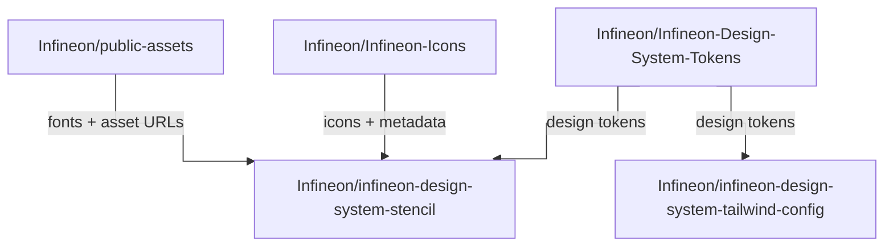
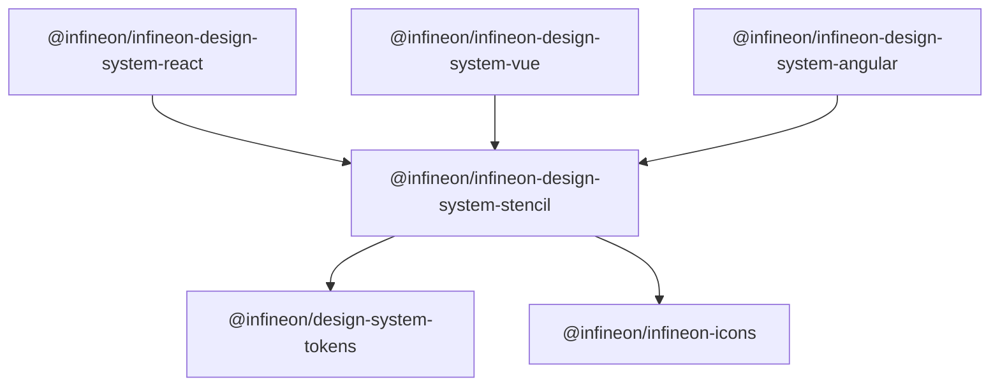
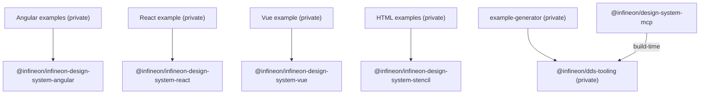
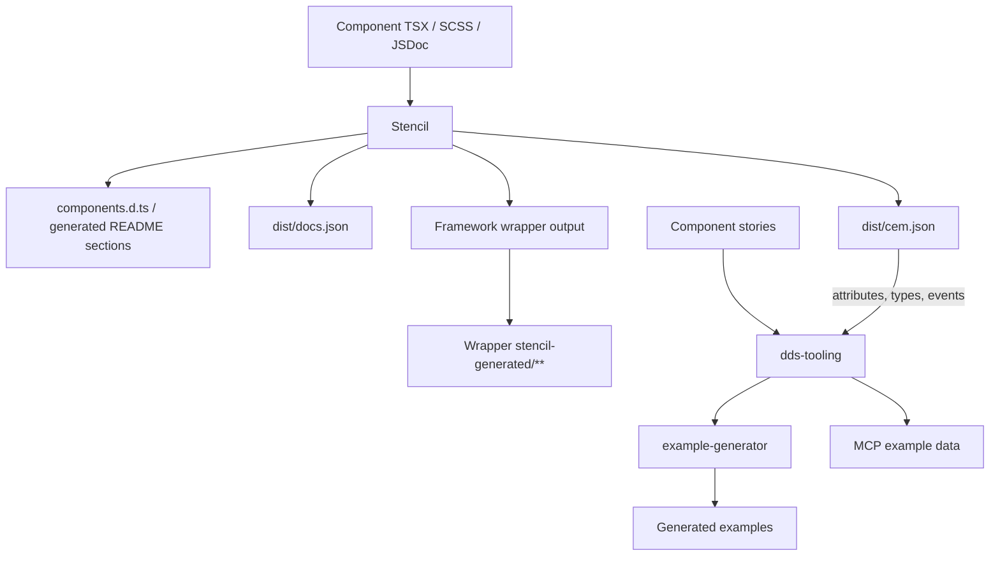
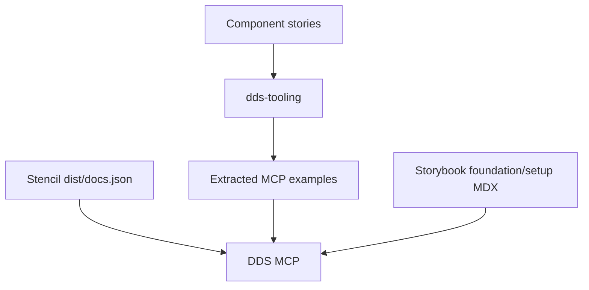

# DDS Ecosystem Architecture

The Digital Design System is maintained across several repositories with distinct ownership boundaries. The Stencil repository is the home for component behavior and the tooling around those components; it is not the source of truth for every shared design asset or integration.

## DDS Ecosystem

The arrows show ownership and consumption relationships, not a promise of a particular build, release, or synchronization pipeline. For example, the Components repository imports the published token package in its global Sass styles and uses the icons package in component stories and the icon preview. DDS source and examples also reference files hosted in Public Assets by URL.

## Published Package Architecture

The graph shows only published DDS packages and their primary first-party dependencies.

`@infineon/design-system-mcp` is also published. It declares Stencil and the React, Vue, and Angular packages as optional peer dependencies.

### Published Packages

| Package | Role and first-party relationships |
| --- | --- |
| `@infineon/design-system-tokens` | Shared token source; Stencil runtime dependency. |
| `@infineon/infineon-icons` | Icon and metadata source; Stencil runtime dependency. |
| `@infineon/infineon-design-system-stencil` | Web Components; depends on Tokens and Icons. |
| `@infineon/infineon-design-system-react` | React wrapper; depends on Stencil. |
| `@infineon/infineon-design-system-vue` | Vue wrapper; depends on Stencil. |
| `@infineon/infineon-design-system-angular` | Angular wrapper; depends on Stencil. Angular is a peer dependency. |
| `@infineon/design-system-mcp` | MCP server; uses DDS Tooling at build time. Stencil and wrappers are optional peers. |

### Private Workspace Packages

The following view shows development and build-time consumers, not the public package hierarchy.

- `@infineon/dds-tooling` provides shared story parsing and code generation. `example-generator` and the MCP build use it.
- The examples are private workspace apps. The HTML CDN example links Stencil locally for development and loads the published bundle from a CDN at runtime.
- The private root workspace orchestrates scripts; it is not published.

Local first-party dependencies use `workspace:*`, so pnpm links packages during development. Tokens and Icons are registry dependencies, not workspace packages. Published consumers install package versions from npm.

- **Runtime dependency:** installed with the package that depends on it.
- **Peer dependency:** supplied by the consuming app; optional peers may be omitted.
- **Build-time dependency:** used to build or generate artifacts, not necessarily shipped at runtime.

The Tailwind config is a separate repository, not a workspace package; `public-assets` is not an npm package. Repository relationships and npm dependencies are different views of the architecture.

## Sources of Truth

Use the authoritative source in the middle column for changes. The right column lists mappings, consumers, and derived outputs; generated artifacts are not upstream sources.

| Concern | Authoritative source | Derived representation or consumers |
| --- | --- | --- |
| Component behavior and public API | `packages/components/src/components/**` (TSX, SCSS, JSDoc) | Stencil API typings, generated README sections, docs/CEM data, wrapper output |
| Framework binding configuration | `packages/components/stencil.config.ts` plus intentional hand-written wrapper integration where needed | Stencil-generated wrapper bindings, copied into wrapper `stencil-generated/**` |
| Component usage and examples | Colocated `*.stories.ts` / `*.stories.tsx` | Storybook rendering; machine-readable input for example and MCP extraction |
| Shared story parsing and framework code generation | `packages/dds-tooling/src/**` | Used by `example-generator` and MCP story extraction; reads generated CEM data for component attributes, types, and events |
| Stories and variants selected for example apps | `example-generator/src/index.ts` | Generated files and marked regions under `examples/*` |
| Storybook foundation and setup documentation | `packages/components/src/storybook/stories/**/*.mdx` | Storybook pages; MCP foundation/setup data |
| MCP runtime behavior | `packages/mcp/src/**` | MCP package behavior, consuming its prepared docs, examples, and foundation assets |
| Figma-to-code mapping | Colocated `*.figma.ts` files | Code Connect mapping; does not define the component API |
| Shared design tokens | [Design Tokens repository](https://github.com/Infineon/Infineon-Design-System-Tokens) | Canonical token definitions; Storybook token pages document them |
| DDS icons and icon metadata | [Icons repository](https://github.com/Infineon/Infineon-Icons) | Canonical icon assets and metadata consumed by DDS |
| Externally hosted shared files | [Public Assets repository](https://github.com/Infineon/public-assets) | Hosted files and URLs referenced by components and documentation |

### Derivation Paths

### MCP Data Sources

MCP combines component API documentation, story-derived examples, and Storybook foundation/setup docs; it does not have a single source.

Stories are machine-readable inputs, not only visual documentation. `example-generator/src/index.ts` has a curated story/variant list; MCP independently discovers component stories and applies its own default-variant fallback. The generator list is therefore not a universal component registry.

Core behavior and the public API belong in Stencil, not framework wrappers. Generated wrapper code is downstream, but wrappers also contain intentional hand-written integration for cases generated output does not cover. Code Connect is authoritative for the Figma-to-code mapping only; Stencil remains authoritative for the component API. Storybook token/foundation pages document the tokens; canonical token definitions remain in the Design Tokens repository.

### Generated Artifacts

- Stencil outputs: `packages/components/src/components.d.ts`; content below `<!-- Auto Generated Below -->` in component `readme.md`; `packages/components/dist/**`; `packages/components/loader/**`; `packages/components/build-wrapper/**`.
- Wrapper bindings: `stencil-generated/**` inside framework wrapper packages. Wrapper packages also include intentional hand-written integration code.
- Examples: generated files and marked regions under `examples/*`.
- MCP: prepared data under `packages/mcp/assets/**` and bundled output under `packages/mcp/dist/**`.

Generated does not necessarily mean untracked. Some generated wrapper and example files are committed, but their upstream source remains authoritative.

## Repository Ownership

| Repository | Owns | Source-of-truth role | Make changes here when |
| --- | --- | --- | --- |
| [Components](https://github.com/Infineon/infineon-design-system-stencil) | Stencil Web Components and their APIs; framework wrappers; Storybook stories and documentation; examples and their generator; MCP integration; Figma Code Connect mappings; repository build tooling. | Source of truth for component behavior and the integrations maintained in this repository. A consumer of shared design tokens and DDS icons. | Changing component behavior, public APIs, component-specific styling, stories/docs, examples, MCP or Code Connect integration, or this repository's build and release tooling. |
| [Design Tokens](https://github.com/Infineon/Infineon-Design-System-Tokens) | Shared DDS design-token definitions and their distributable formats. | Source of truth for shared Design System token values. The Components repository consumes the published `@infineon/design-system-tokens` package. | Changing shared token values or token definitions. Update token use or component-specific presentation in Components when the token itself is not changing. |
| [Icons](https://github.com/Infineon/Infineon-Icons) | DDS icon artwork and icon metadata, distributed through the DDS icons package. | Source of truth for DDS icons and their metadata. The Components repository imports `@infineon/infineon-icons` for icon data and metadata. | Adding or changing an icon, its artwork, its name, or its metadata. Change Components for icon rendering behavior, component icon choices, or how the icon library is presented in Storybook. |
| [Tailwind Config](https://github.com/Infineon/infineon-design-system-tailwind-config) | Tailwind and utility-CSS integration based on the shared DDS design tokens. | Downstream integration of the Tokens repository, not an independent source of design-token values. | Changing Tailwind configuration, utility mappings, or the Tailwind package's compatibility and integration behavior. Change Tokens when shared token values or definitions should change. |
| [Public Assets](https://github.com/Infineon/public-assets) | Publicly accessible Infineon files such as fonts, images, and other assets intended to be referenced externally. | Hosts the published asset files; it is not the source of truth for DDS component behavior, tokens, or icon metadata. | Adding or replacing a shared externally hosted asset, or changing a hosted file referenced by DDS. Change Components when changing how a component uses an asset, its URL, or its fallback behavior. |
