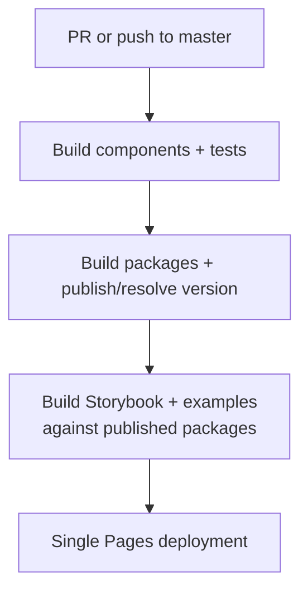
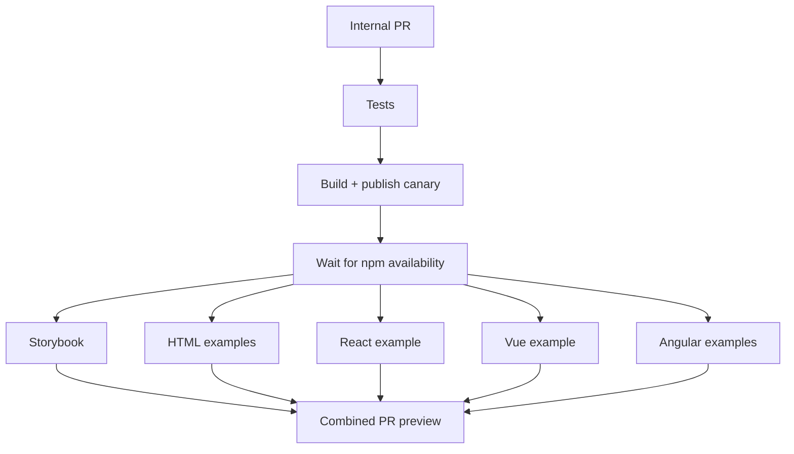
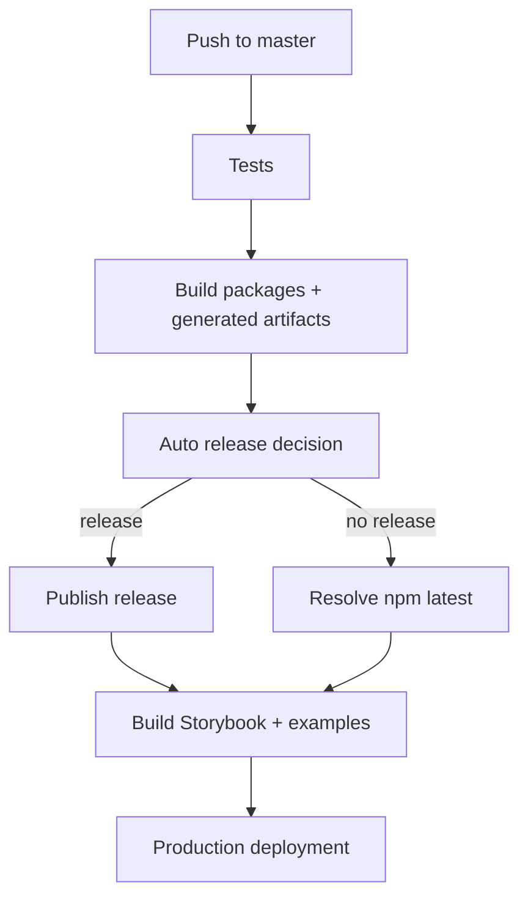
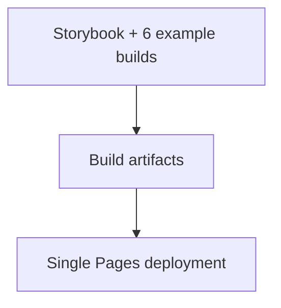

# CI/CD

This document explains the CI/CD architecture of the Infineon Design System Stencil repository. It focuses on how pull requests and `master` changes move through testing, npm publishing, consumer validation, and GitHub Pages deployment.

For local development commands and contributor workflows, see [`CONTRIBUTING.md`](../CONTRIBUTING.md).

## Overview

The main workflow is [`.github/workflows/main.yml`](../.github/workflows/main.yml). It orchestrates tests, package publication, Storybook/example builds, deployment, and release notifications.



The key design decision is that Storybook and the example applications are built against a **published npm version**, not only against local workspace links. This validates the package boundary that real consumers use.

On push events, commits containing `ci skip` or `skip ci` skip the main pipeline. Auto-generated changelog/version commits use `[skip ci]` so a release does not recursively trigger another release run.

## Workflow Files

| File | Responsibility |
| --- | --- |
| [`.github/workflows/main.yml`](../.github/workflows/main.yml) | Top-level orchestration for PRs, `master`, preview deployment, production deployment, and notifications. |
| [`.github/workflows/release-label-check.yml`](../.github/workflows/release-label-check.yml) | Verifies that a PR has a release label. |
| [`.github/workflows/shared-build-publish-libraries.yml`](../.github/workflows/shared-build-publish-libraries.yml) | Builds packages, regenerates derived artifacts, verifies consistency, and runs Auto release/canary publishing. |
| [`.github/workflows/shared-build-storybook.yml`](../.github/workflows/shared-build-storybook.yml) | Builds Storybook using the selected published package version. |
| [`.github/workflows/shared-build-example.yml`](../.github/workflows/shared-build-example.yml) | Builds one example application against published DDS packages. |
| [`.github/workflows/shared-deploy-pages.yml`](../.github/workflows/shared-deploy-pages.yml) | Combines build artifacts and performs preview, production, or cleanup deployment. |
| [`.github/actions/check-package-availability/action.yml`](../.github/actions/check-package-availability/action.yml) | Waits until required npm packages are retrievable. |

## Pull Request Pipeline

Internal pull requests use the full preview pipeline:



For a PR whose source branch belongs to this repository, Auto publishes a canary version with `auto canary --force`. The exact canary version is then passed to Storybook and the example builds.

This is intentional: the preview validates the package that a consumer would install, rather than only the local `workspace:*` packages.

Fork pull requests do **not** enter the publishing workflow. This prevents untrusted fork code from receiving npm publishing authority. They currently receive the source/test portion of the pipeline but not the canary-based preview path.

When a PR is closed, its Pages preview is removed.

## Master / Release Pipeline

A push to `master` follows the same initial build path, then Auto determines whether a stable release is required.



If a release is required, the workflow runs `auto shipit`.

If no release is required, the workflow resolves the current npm `latest` version of `@infineon/infineon-design-system-stencil`. That version is still passed to Storybook and the examples, so documentation or internal changes can deploy without creating a new npm release.

## Publishing and Versioning

The publication workflow performs the high-level sequence:

```text
build Stencil
→ build dds-tooling
→ generate examples
→ build Vue / React / Angular wrappers
→ build MCP
→ verify generated artifacts
→ Auto release or canary
```

Wireit handles package-level dependency ordering and caching underneath these explicit workflow steps.

The public packages released from this monorepo are:

- `@infineon/infineon-design-system-stencil`
- `@infineon/infineon-design-system-react`
- `@infineon/infineon-design-system-vue`
- `@infineon/infineon-design-system-angular`
- `@infineon/design-system-mcp`

`pnpm` manages the workspace and local dependencies. Auto/Lerna manage versioning and release orchestration. The public packages are published to the npm registry.

### Auto release behavior

Auto is configured in [`auto.config.js`](../auto.config.js) and runs from the shared publishing workflow. Auto uses the latest GitHub Release (and its tag) as the previous-release boundary; PR release labels determine the next semantic version. [`lerna.json`](../lerna.json) records the fixed monorepo package version. On `master`, CI first runs `auto shipit --dry-run --quiet`; if it returns a version, CI runs `auto shipit` to publish it. Otherwise, CI uses npm's current `latest` version. On eligible internal PRs, CI instead publishes a forced canary for previews.

Auto generates the root [`CHANGELOG.md`](../CHANGELOG.md). The `omit-release-notes` plugin excludes PRs labeled `skip-changelog`; this is separate from `skip-release`, which prevents a stable release from that PR. The npm plugin is configured not to create subpackage or monorepo-specific changelogs. The other configured plugins handle the `released` label and first-time contributors.

### Release notifications

This workflow sends release notes through `auto-plugin-webex`; notification failures do not fail publishing. Auto also offers a [Microsoft Teams plugin](https://intuit.github.io/auto/docs/generated/microsoft-teams). Separately, after a successful `master` publish, [main.yml](../.github/workflows/main.yml) dispatches the released version to the One Platform repository.

### Release labels

PRs are expected to use one of:

- `patch`
- `minor`
- `major`
- `skip-release`

`skip-release` does not skip CI and does not prevent an internal PR canary. It prevents the PR from causing a normal stable release when merged.

`skip-changelog` is handled separately by Auto and omits the PR from release notes.

### Trusted publishing

npm publication uses GitHub Actions OIDC/trusted publishing. The workflow requests `id-token: write` and verifies compatible Node.js/npm versions before publishing.

Fork PRs are excluded from this workflow, so they cannot receive publishing authority.

### Angular package

The Angular wrapper publishes from its `dist` directory. [`packages/wrapper-angular/scripts/prepack.js`](../packages/wrapper-angular/scripts/prepack.js) synchronizes the package version into `dist/package.json` and replaces the Stencil `workspace:*` dependency with the concrete release version.

## Validating Published Packages

After publication, CI waits until the required package/version is retrievable from npm.

The package-availability action polls the registry with exponential backoff. Each consumer waits only for the DDS packages it needs.

| Consumer | Required DDS packages |
| --- | --- |
| Storybook | Stencil |
| HTML examples | Stencil |
| React example | Stencil + React |
| Vue example | Stencil + Vue |
| Angular examples | Stencil + Angular |

Local development uses `workspace:*`, while CI replaces those references with the exact published version:

```text
local development → workspace packages
CI preview/release → published npm packages
```

The HTML CDN example additionally rewrites its jsDelivr URLs to the selected version and removes its local Stencil dependency.

Storybook follows the same principle: locally it uses the local Stencil build, while CI uses the selected published package version.

### Generated artifact verification

Before publishing, CI rebuilds generated artifacts and checks that the working tree has not changed. This catches cases where generated wrappers, component documentation, or example output were not committed together with their source changes.

See [`ARCHITECTURE.md`](./ARCHITECTURE.md) for the source-of-truth and generated-file boundaries.

## Deployment

Storybook and all six example applications build independently and upload short-lived artifacts.

The deployment workflow then downloads all seven artifacts and validates that each contains an `index.html` before modifying `gh-pages`.



This keeps builds parallel while making deployment atomic: users should not see a mixture of sites built from different package versions.

For PRs, the combined output is deployed below the PR preview area and linked from a sticky PR comment.

For production, the workflow replaces only the seven directories managed by this pipeline and commits them to `gh-pages` together.

PR preview deployment, production deployment, and preview cleanup all modify the same branch, so they use the shared `gh-mutex-deploy` mutex.

The intended model is:

```text
builds      → parallel
deployments → serialized
```

## Concurrency and Security

Superseded PR test/build work can be cancelled so that the newest PR commit takes precedence.

Publishing and deployment require more care:

- fork PRs must never receive publishing authority;
- deployment to the shared `gh-pages` branch must be serialized;
- stable publication should not be interrupted once it has started.

The main pipeline currently has separate concurrency controls for tests/builds and a deployment mutex for shared Pages state.

## Failure Guide

| Failure point | Usually indicates |
| --- | --- |
| Tests | Component build or test regression. |
| Package build | A publishable package cannot be generated. |
| Generated-file check | Generated output does not match committed files. |
| Auto / publish | Release metadata, versioning, or npm publication problem. |
| Package availability | Expected package/version is not retrievable from npm. |
| Storybook build | Published Stencil package and current Storybook/docs cannot build together. |
| Example build | Published package integration is broken for that framework. |
| Deployment validation | One of the expected artifacts is missing or invalid. |
| Pages deployment | Shared `gh-pages` state could not be updated. |

## Related Documentation

- [`ARCHITECTURE.md`](./ARCHITECTURE.md) — repository ecosystem, package relationships, and sources of truth.
- [`CONTRIBUTING.md`](../CONTRIBUTING.md) — local development and contributor workflow.
- [`USAGE.md`](../USAGE.md) — consuming DDS packages.
- [`AGENTS.md`](../AGENTS.md) — repository-wide rules and generated-file boundaries.
