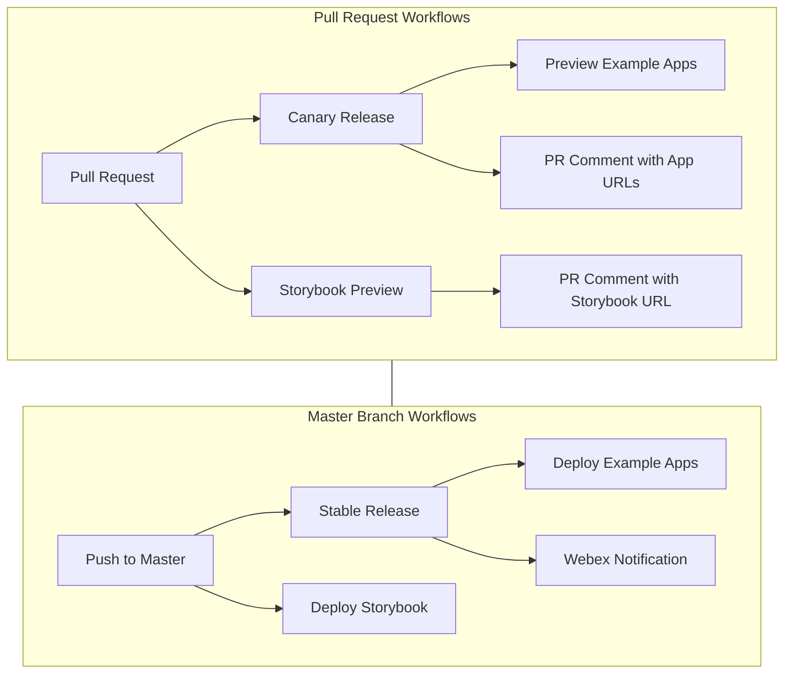

# CI/CD Workflow Documentation

## Workflow Diagram

## Package Update Process

Our GitHub Actions workflows automatically update dependency versions across multiple packages and applications. These workflows run on:
- Pull requests (creating canary versions)
- Merges to master (creating stable versions)

## Developer Implications

### Implications for Pull Requests

When the package.json files are modified on GitHub (e.g., due to deployment by GitHub Actions), these changes will affect the local working copies of any developers who have pull requests open against the affected branches. Here are the main points to consider:

- **Local Pull Request State**: Developers working on local copies will have an outdated state of the package.json files if the dependencies were updated on GitHub.
- **Pulling Latest Changes**: Developers will need to pull the latest changes from the remote repository to ensure their local working copy is up to date, especially if they want to test their changes against the most recent dependency versions.

### Best Practices

**Git Workflow**:

- **Fetching and Pulling**: Developers should regularly `git fetch` and `git pull` the latest changes from the remote repository, especially before pushing their changes or creating new commits.
- **Rebasing**: Encourage developers to rebase their changes on top of the latest main (or equivalent) branch. This ensures their changes are tested against the latest code and dependencies.
- **Merging Conflicts**: Be prepared to handle merge conflicts that might arise due to the updated package.json files. These conflicts will need to be resolved manually.