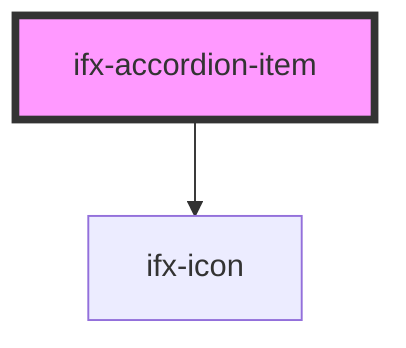

# ifx-accordion-item

<!-- Auto Generated Below -->

## Properties

| Property    | Attribute    | Description | Type      | Default     |
| ----------- | ------------ | ----------- | --------- | ----------- |
| `AriaLevel` | `aria-level` |             | `number`  | `3`         |
| `caption`   | `caption`    |             | `string`  | `undefined` |
| `open`      | `open`       |             | `boolean` | `false`     |

## Events

| Event      | Description | Type               |
| ---------- | ----------- | ------------------ |
| `ifxClose` |             | `CustomEvent<any>` |
| `ifxOpen`  |             | `CustomEvent<any>` |

## Dependencies

### Depends on

- [ifx-icon](../icon)

### Graph

----------------------------------------------

*Built with [StencilJS](https://stenciljs.com/)*
