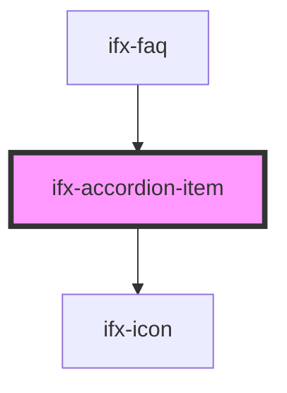

# ifx-accordion-item

<!-- Auto Generated Below -->

## Properties

| Property          | Attribute          | Description | Type      | Default     |
| ----------------- | ------------------ | ----------- | --------- | ----------- |
| `caption`         | `caption`          |             | `string`  | `undefined` |
| `initialCollapse` | `initial-collapse` |             | `boolean` | `true`      |
| `open`            | `open`             |             | `boolean` | `false`     |

## Events

| Event          | Description | Type               |
| -------------- | ----------- | ------------------ |
| `ifxItemClose` |             | `CustomEvent<any>` |
| `ifxItemOpen`  |             | `CustomEvent<any>` |

## Dependencies

### Used by

 - [ifx-faq](../../stories/setup-and-installation/faq)

### Depends on

- [ifx-icon](../icon)

### Graph

----------------------------------------------

*Built with [StencilJS](https://stenciljs.com/)*
