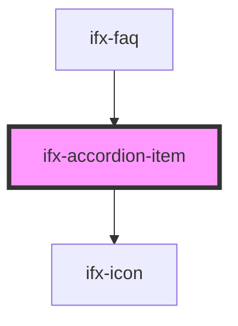

# ifx-accordion-item

<!-- Auto Generated Below -->

## Properties

| Property       | Attribute       | Description                                             | Type      | Default     |
| -------------- | --------------- | ------------------------------------------------------- | --------- | ----------- |
| `caption`      | `caption`       | The caption of the accordion item.                      | `string`  | `undefined` |
| `headingLevel` | `heading-level` | The aria-level attribute for the accordion item header. | `3`       | `3`         |
| `icon`         | `icon`          | The icon to be displayed in the accordion item header.  | `string`  | `""`        |
| `open`         | `open`          | Set the open attribute to open the accordion item.      | `boolean` | `false`     |

## Events

| Event      | Description                                                                                 | Type               |
| ---------- | ------------------------------------------------------------------------------------------- | ------------------ |
| `ifxClose` | Event emitted when an accordion item is closed.                                             | `CustomEvent<any>` |
| `ifxOpen`  | Set the mutable attribute to allow or not allow the accordion item to be opened and closed. | `CustomEvent<any>` |

## Dependencies

### Used by

 - [ifx-faq](../../storybook/stories/setup-and-installation/faq)

### Depends on

- [ifx-icon](../icon)

### Graph

----------------------------------------------

*Built with [StencilJS](https://stenciljs.com/)*
