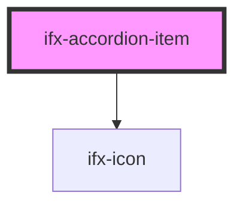

# ifx-accordion-item

<!-- Auto Generated Below -->

## Properties

| Property          | Attribute           | Description                                             | Type      | Default     |
| ----------------- | ------------------- | ------------------------------------------------------- | --------- | ----------- |
| `ariaLevelNumber` | `aria-level-number` | The aria-level attribute for the accordion item header. | `number`  | `3`         |
| `caption`         | `caption`           | The caption of the accordion item.                      | `string`  | `undefined` |
| `icon`            | `icon`              | The icon to be displayed in the accordion item header.  | `string`  | `""`        |
| `open`            | `open`              | Set the open attribute to open the accordion item.      | `boolean` | `false`     |

## Events

| Event      | Description                                     | Type               |
| ---------- | ----------------------------------------------- | ------------------ |
| `ifxClose` | Event emitted when an accordion item is closed. | `CustomEvent<any>` |
| `ifxOpen`  | Event emitted when accordion is opened.         | `CustomEvent<any>` |

## Dependencies

### Depends on

- [ifx-icon](../icon)

### Graph

```mermaid
graph TD;
  ifx-accordion-item --> ifx-icon
  style ifx-accordion-item fill:#f9f,stroke:#333,stroke-width:4px
```

----------------------------------------------

*Built with [StencilJS](https://stenciljs.com/)*
