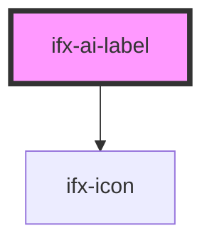

# ifx-ai-label

<!-- Auto Generated Below -->

## Properties

| Property  | Attribute | Description | Type                | Default   |
| --------- | --------- | ----------- | ------------------- | --------- |
| `divider` | `divider` |             | `boolean`           | `true`    |
| `variant` | `variant` |             | `"icon" \| "label"` | `'label'` |

## Dependencies

### Depends on

- [ifx-icon](../icon)

### Graph

----------------------------------------------

*Built with [StencilJS](https://stenciljs.com/)*
