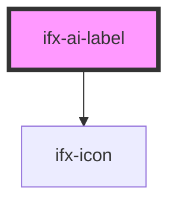

# ifx-ai-label

<!-- Auto Generated Below -->

## Properties

| Property  | Attribute | Description                               | Type                | Default   |
| --------- | --------- | ----------------------------------------- | ------------------- | --------- |
| `divider` | `divider` | Determines whether to show a divider line | `boolean`           | `true`    |
| `variant` | `variant` | Display variant - either label or icon    | `"icon" \| "label"` | `'label'` |

## Dependencies

### Depends on

- [ifx-icon](../icon)

### Graph

----------------------------------------------

*Built with [StencilJS](https://stenciljs.com/)*
