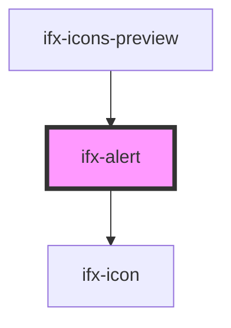

# ifx-alert

<!-- Auto Generated Below -->

## Properties

| Property   | Attribute   | Description | Type                                                        | Default       |
| ---------- | ----------- | ----------- | ----------------------------------------------------------- | ------------- |
| `AriaLive` | `aria-live` |             | `string`                                                    | `'assertive'` |
| `closable` | `closable`  |             | `boolean`                                                   | `true`        |
| `icon`     | `icon`      |             | `string`                                                    | `undefined`   |
| `variant`  | `variant`   |             | `"danger" \| "info" \| "primary" \| "success" \| "warning"` | `'primary'`   |

## Events

| Event      | Description | Type               |
| ---------- | ----------- | ------------------ |
| `ifxClose` |             | `CustomEvent<any>` |

## Dependencies

### Used by

 - [ifx-icons-preview](../icons-preview)

### Depends on

- [ifx-icon](../icon)

### Graph

----------------------------------------------

*Built with [StencilJS](https://stenciljs.com/)*
