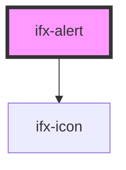

# ifx-alert

<!-- Auto Generated Below -->

## Properties

| Property   | Attribute  | Description | Type                                                          | Default     |
| ---------- | ---------- | ----------- | ------------------------------------------------------------- | ----------- |
| `closable` | `closable` |             | `boolean`                                                     | `true`      |
| `icon`     | `icon`     |             | `string`                                                      | `undefined` |
| `variant`  | `variant`  |             | `"danger" \| "info" \| "primary" \| "secondary" \| "warning"` | `'primary'` |

## Events

| Event      | Description | Type               |
| ---------- | ----------- | ------------------ |
| `ifxClose` |             | `CustomEvent<any>` |

## Dependencies

### Depends on

- [ifx-icon](../icon)

### Graph

----------------------------------------------

*Built with [StencilJS](https://stenciljs.com/)*
