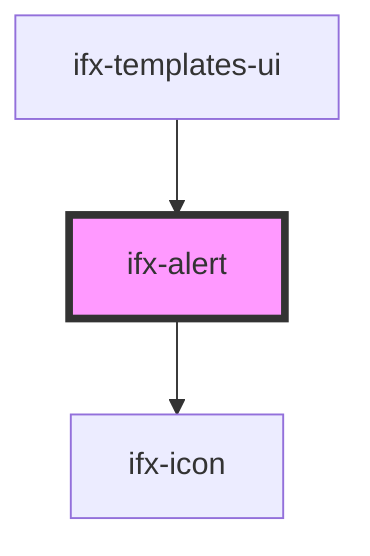

# ifx-alert

<!-- Auto Generated Below -->

## Properties

| Property       | Attribute        | Description                                               | Type                                                        | Default       |
| -------------- | ---------------- | --------------------------------------------------------- | ----------------------------------------------------------- | ------------- |
| `ariaLiveText` | `aria-live-text` | Aria live region setting for accessibility announcements. | `"assertive"`                                               | `"assertive"` |
| `closable`     | `closable`       | Wether the component can be closed by the user.           | `boolean`                                                   | `true`        |
| `icon`         | `icon`           | Name or identifier of the icon to display.                | `string`                                                    | `undefined`   |
| `variant`      | `variant`        | Visual style variant of the component.                    | `"danger" \| "info" \| "primary" \| "success" \| "warning"` | `"primary"`   |

## Events

| Event      | Description                                 | Type               |
| ---------- | ------------------------------------------- | ------------------ |
| `ifxClose` | Event emitted when the component is closed. | `CustomEvent<any>` |

## Dependencies

### Used by

 - [ifx-templates-ui](../templates/templates-ui)

### Depends on

- [ifx-icon](../icon)

### Graph

```mermaid
graph TD;
  ifx-alert --> ifx-icon
  ifx-templates-ui --> ifx-alert
  style ifx-alert fill:#f9f,stroke:#333,stroke-width:4px
```

----------------------------------------------

*Built with [StencilJS](https://stenciljs.com/)*
