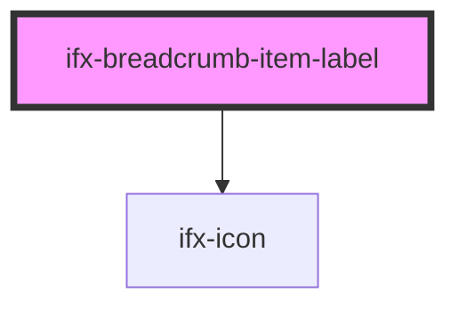

# ifx-breadcrumb-item-label

<!-- Auto Generated Below -->

## Properties

| Property | Attribute | Description | Type     | Default     |
| -------- | --------- | ----------- | -------- | ----------- |
| `href`   | `href`    |             | `string` | `undefined` |
| `icon`   | `icon`    |             | `string` | `undefined` |
| `target` | `target`  |             | `string` | `"_self"`   |

## Events

| Event                       | Description | Type                            |
| --------------------------- | ----------- | ------------------------------- |
| `breadcrumbMenuIconWrapper` |             | `CustomEvent<CustomEvent<any>>` |

## Dependencies

### Depends on

- [ifx-icon](../icon)

### Graph

----------------------------------------------

*Built with [StencilJS](https://stenciljs.com/)*
