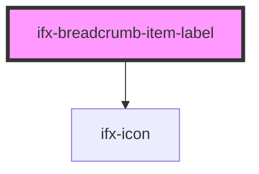

# ifx-breadcrumb-item-label

<!-- Auto Generated Below -->

## Properties

| Property | Attribute | Description                                | Type     | Default     |
| -------- | --------- | ------------------------------------------ | -------- | ----------- |
| `href`   | `href`    | URL the breadcrumb item links to.          | `string` | `undefined` |
| `icon`   | `icon`    | Icon displayed inside the breadcrumb item. | `string` | `undefined` |
| `target` | `target`  | Where to open the link.                    | `string` | `"_self"`   |

## Events

| Event                       | Description                                          | Type                       |
| --------------------------- | ---------------------------------------------------- | -------------------------- |
| `breadcrumbMenuIconWrapper` | Fires with the icon wrapper element when it's ready. | `CustomEvent<HTMLElement>` |

## Dependencies

### Depends on

- [ifx-icon](../icon)

### Graph

```mermaid
graph TD;
  ifx-breadcrumb-item-label --> ifx-icon
  style ifx-breadcrumb-item-label fill:#f9f,stroke:#333,stroke-width:4px
```

----------------------------------------------

*Built with [StencilJS](https://stenciljs.com/)*
