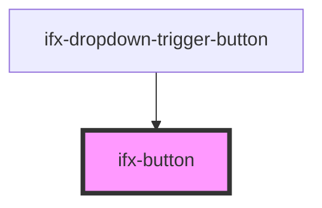

# ifx-button

<!-- Auto Generated Below -->

## Properties

| Property    | Attribute    | Description | Type                                     | Default     |
| ----------- | ------------ | ----------- | ---------------------------------------- | ----------- |
| `disabled`  | `disabled`   |             | `boolean`                                | `false`     |
| `fullWidth` | `full-width` |             | `boolean`                                | `false`     |
| `href`      | `href`       |             | `string`                                 | `undefined` |
| `size`      | `size`       |             | `string`                                 | `'m'`       |
| `target`    | `target`     |             | `string`                                 | `'_self'`   |
| `theme`     | `theme`      |             | `"danger" \| "default" \| "inverse"`     | `'default'` |
| `type`      | `type`       |             | `"button" \| "reset" \| "submit"`        | `"button"`  |
| `variant`   | `variant`    |             | `"primary" \| "secondary" \| "tertiary"` | `'primary'` |

## Methods

### `setFocus() => Promise<void>`

#### Returns

Type: `Promise<void>`

## Dependencies

### Used by

 - [ifx-dropdown-trigger-button](../dropdown/dropdown-trigger-button)

### Graph

----------------------------------------------

*Built with [StencilJS](https://stenciljs.com/)*
