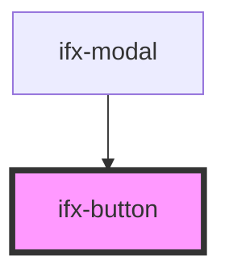

# ifx-button

<!-- Auto Generated Below -->

## Properties

| Property   | Attribute  | Description | Type                                                             | Default     |
| ---------- | ---------- | ----------- | ---------------------------------------------------------------- | ----------- |
| `color`    | `color`    |             | `"danger" \| "primary" \| "secondary" \| "success" \| "warning"` | `'primary'` |
| `disabled` | `disabled` |             | `boolean`                                                        | `false`     |
| `href`     | `href`     |             | `string`                                                         | `undefined` |
| `size`     | `size`     |             | `string`                                                         | `'m'`       |
| `target`   | `target`   |             | `string`                                                         | `'_self'`   |
| `variant`  | `variant`  |             | `"outline" \| "outline-text" \| "solid"`                         | `'solid'`   |

## Methods

### `setFocus() => Promise<void>`

#### Returns

Type: `Promise<void>`

## Dependencies

### Used by

 - [ifx-modal](../modal)

### Graph

----------------------------------------------

*Built with [StencilJS](https://stenciljs.com/)*
