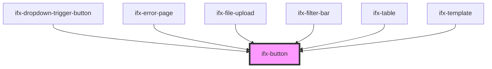

# ifx-button

<!-- Auto Generated Below -->

## Properties

| Property        | Attribute         | Description                                                 | Type                                     | Default     |
| --------------- | ----------------- | ----------------------------------------------------------- | ---------------------------------------- | ----------- |
| `ariaLabelText` | `aria-label-text` | Accessible label for screen readers when text is not enough | `string`                                 | `undefined` |
| `disabled`      | `disabled`        | Wether the button is disabled and not clickable.            | `boolean`                                | `false`     |
| `fullWidth`     | `full-width`      | If true, button stretches to fill the available width.      | `boolean`                                | `false`     |
| `href`          | `href`            | URL the Button should navigate to when clicked.             | `string`                                 | `undefined` |
| `size`          | `size`            | Button size (xs, s, m, l).                                  | `string`                                 | `"m"`       |
| `target`        | `target`          | Where to open the link.                                     | `string`                                 | `"_self"`   |
| `theme`         | `theme`           | Color theme of the button.                                  | `"danger" \| "default" \| "inverse"`     | `"default"` |
| `type`          | `type`            | Native button type.                                         | `"button" \| "reset" \| "submit"`        | `"button"`  |
| `variant`       | `variant`         | Button style level (visual prominence).                     | `"primary" \| "secondary" \| "tertiary"` | `"primary"` |

## Methods

### `setFocus() => Promise<void>`

Move keayboard focus to the button.

#### Returns

Type: `Promise<void>`

## Dependencies

### Used by

 - [ifx-dropdown-trigger-button](../dropdown/dropdown-trigger-button)
 - [ifx-error-page](../error-page)
 - [ifx-file-upload](../file-upload)
 - [ifx-filter-bar](../table-advanced-version/filter-bar)
 - [ifx-table](../table-advanced-version)
 - [ifx-template](../templates/template)

### Graph

```mermaid
graph TD;
  ifx-dropdown-trigger-button --> ifx-button
  ifx-error-page --> ifx-button
  ifx-file-upload --> ifx-button
  ifx-filter-bar --> ifx-button
  ifx-table --> ifx-button
  ifx-template --> ifx-button
  style ifx-button fill:#f9f,stroke:#333,stroke-width:4px
```

----------------------------------------------

*Built with [StencilJS](https://stenciljs.com/)*
