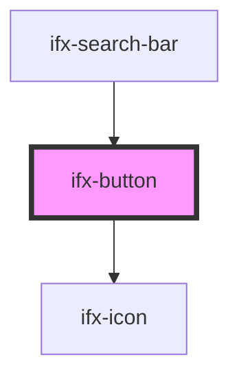

# ifx-button

<!-- Auto Generated Below -->

## Properties

| Property   | Attribute  | Description | Type                                                             | Default     |
| ---------- | ---------- | ----------- | ---------------------------------------------------------------- | ----------- |
| `color`    | `color`    |             | `"danger" \| "primary" \| "secondary" \| "success" \| "warning"` | `undefined` |
| `disabled` | `disabled` |             | `boolean`                                                        | `undefined` |
| `href`     | `href`     |             | `string`                                                         | `undefined` |
| `icon`     | `icon`     |             | `string`                                                         | `undefined` |
| `position` | `position` |             | `string`                                                         | `'left'`    |
| `size`     | `size`     |             | `string`                                                         | `undefined` |
| `target`   | `target`   |             | `string`                                                         | `'_self'`   |
| `variant`  | `variant`  |             | `"outline" \| "outline-text" \| "solid"`                         | `undefined` |

## Methods

### `setFocus() => Promise<void>`

#### Returns

Type: `Promise<void>`

## Dependencies

### Used by

 - [ifx-search-bar](../search-bar)

### Depends on

- [ifx-icon](../icon)

### Graph

----------------------------------------------

*Built with [StencilJS](https://stenciljs.com/)*
