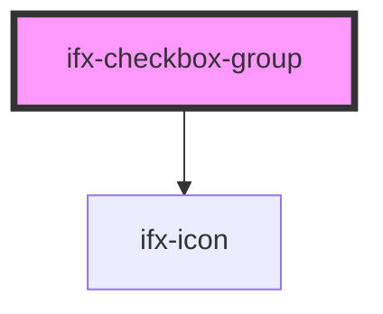

# ifx-checkbox-group

<!-- Auto Generated Below -->

## Properties

| Property           | Attribute            | Description | Type                         | Default              |
| ------------------ | -------------------- | ----------- | ---------------------------- | -------------------- |
| `alignment`        | `alignment`          |             | `"horizontal" \| "vertical"` | `'vertical'`         |
| `captionText`      | `caption-text`       |             | `string`                     | `undefined`          |
| `disabledItems`    | --                   |             | `string[]`                   | `[]`                 |
| `errorItems`       | --                   |             | `string[]`                   | `[]`                 |
| `groupLabelText`   | `group-label-text`   |             | `string`                     | `'Group Label Text'` |
| `indeterminate`    | --                   |             | `string[]`                   | `[]`                 |
| `selectedItems`    | --                   |             | `string[]`                   | `[]`                 |
| `showCaption`      | `show-caption`       |             | `boolean`                    | `undefined`          |
| `showCaptionError` | `show-caption-error` |             | `boolean`                    | `undefined`          |
| `showCaptionIcon`  | `show-caption-icon`  |             | `boolean`                    | `undefined`          |
| `showGroupLabel`   | `show-group-label`   |             | `boolean`                    | `undefined`          |
| `size`             | `size`               |             | `string`                     | `undefined`          |

## Dependencies

### Depends on

- [ifx-icon](../icon)

### Graph

----------------------------------------------

*Built with [StencilJS](https://stenciljs.com/)*
