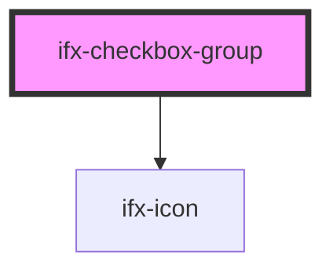

# ifx-checkbox-group

<!-- Auto Generated Below -->

## Properties

| Property          | Attribute           | Description                                 | Type                         | Default              |
| ----------------- | ------------------- | ------------------------------------------- | ---------------------------- | -------------------- |
| `alignment`       | `alignment`         | Layout direction of the radio group         | `"horizontal" \| "vertical"` | `"vertical"`         |
| `captionText`     | `caption-text`      | Text used for the caption.                  | `string`                     | `undefined`          |
| `groupLabelText`  | `group-label-text`  | Text used for the group label.              | `string`                     | `"Group Label Text"` |
| `required`        | `required`          | Wether selecting an option is required.     | `boolean`                    | `false`              |
| `showCaption`     | `show-caption`      | Wether to show a caption under the group.   | `boolean`                    | `undefined`          |
| `showCaptionIcon` | `show-caption-icon` | Wether to show an icon next to the caption. | `boolean`                    | `undefined`          |
| `showGroupLabel`  | `show-group-label`  | Wether to show the group label.             | `boolean`                    | `undefined`          |
| `size`            | `size`              | Size of the radio group                     | `string`                     | `undefined`          |

## Methods

### `setGroupError(error: boolean) => Promise<void>`

Method to set the error state of all checkboxes in the group.

#### Parameters

| Name    | Type      | Description |
| ------- | --------- | ----------- |
| `error` | `boolean` |             |

#### Returns

Type: `Promise<void>`

## Dependencies

### Depends on

- [ifx-icon](../icon)

### Graph

```mermaid
graph TD;
  ifx-checkbox-group --> ifx-icon
  style ifx-checkbox-group fill:#f9f,stroke:#333,stroke-width:4px
```

----------------------------------------------

*Built with [StencilJS](https://stenciljs.com/)*
