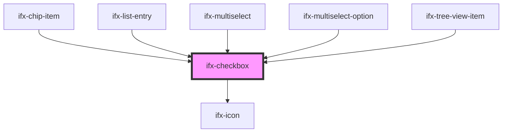

# ifx-checkbox

<!-- Auto Generated Below -->

## Properties

| Property        | Attribute       | Description | Type      | Default     |
| --------------- | --------------- | ----------- | --------- | ----------- |
| `checked`       | `checked`       |             | `boolean` | `false`     |
| `disabled`      | `disabled`      |             | `boolean` | `false`     |
| `error`         | `error`         |             | `boolean` | `false`     |
| `indeterminate` | `indeterminate` |             | `boolean` | `false`     |
| `size`          | `size`          |             | `string`  | `"m"`       |
| `value`         | `value`         |             | `string`  | `undefined` |

## Events

| Event       | Description | Type               |
| ----------- | ----------- | ------------------ |
| `ifxChange` |             | `CustomEvent<any>` |
| `ifxError`  |             | `CustomEvent<any>` |

## Methods

### `isChecked() => Promise<boolean>`

#### Returns

Type: `Promise<boolean>`

### `toggleCheckedState(newVal: boolean) => Promise<void>`

#### Parameters

| Name     | Type      | Description |
| -------- | --------- | ----------- |
| `newVal` | `boolean` |             |

#### Returns

Type: `Promise<void>`

## Dependencies

### Used by

 - [ifx-chip-item](../chip/chip-item)
 - [ifx-list-entry](../table-advanced-version/list/list-entry)
 - [ifx-multiselect](../select/multi-select)
 - [ifx-multiselect-option](../select/multi-select)
 - [ifx-tree-view-item](../tree-view)

### Depends on

- [ifx-icon](../icon)

### Graph

----------------------------------------------

*Built with [StencilJS](https://stenciljs.com/)*
