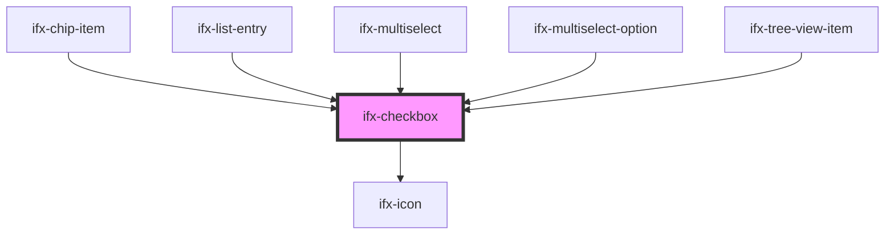

# ifx-checkbox

<!-- Auto Generated Below -->

## Properties

| Property        | Attribute       | Description                                                                                                                                                                                                            | Type      | Default     |
| --------------- | --------------- | ---------------------------------------------------------------------------------------------------------------------------------------------------------------------------------------------------------------------- | --------- | ----------- |
| `checked`       | `checked`       | The state of the checkbox. When true, the checkbox is checked; when false, it is unchecked.                                                                                                                            | `boolean` | `false`     |
| `disabled`      | `disabled`      | Indicates whether the checkbox is disabled. When true, the checkbox cannot be interacted with and will have a disabled appearance.                                                                                     | `boolean` | `false`     |
| `error`         | `error`         | Indicates whether the checkbox is in an error state. When true, the checkbox will have an error appearance.                                                                                                            | `boolean` | `false`     |
| `indeterminate` | `indeterminate` | Indicates whether the checkbox is in an indeterminate state. When true, the checkbox will have an indeterminate appearance, which is typically used to indicate a "partially selected" state in a group of checkboxes. | `boolean` | `false`     |
| `size`          | `size`          | The size of the checkbox. Can be "m" for medium (default) or "s" for small. This prop controls the overall dimensions of the checkbox and its label.                                                                   | `string`  | `"m"`       |
| `value`         | `value`         | The value associated with the checkbox.  This value is typically submitted with a form when the checkbox is checked.  If not specified, it defaults to "on" when the checkbox is checked.                              | `string`  | `undefined` |

## Events

| Event       | Description                                                                                    | Type                   |
| ----------- | ---------------------------------------------------------------------------------------------- | ---------------------- |
| `ifxChange` | Event emitted when the checkbox state changes. Emits the new checked state as a boolean value. | `CustomEvent<boolean>` |
| `ifxError`  | Event emitted when the error state changes. Emits the new error state as a boolean value.      | `CustomEvent<boolean>` |

## Methods

### `isChecked() => Promise<boolean>`

Method to get the current checked state of the checkbox.

#### Returns

Type: `Promise<boolean>`

A promise that resolves to a boolean indicating whether the checkbox is checked.

### `setChecked(newVal: boolean) => Promise<void>`

Method to set the checked state of the checkbox.

#### Parameters

| Name     | Type      | Description                                               |
| -------- | --------- | --------------------------------------------------------- |
| `newVal` | `boolean` | A boolean value to set the checked state of the checkbox. |

#### Returns

Type: `Promise<void>`

A promise that resolves when the checked state has been updated.

### `toggle() => Promise<boolean>`

Toggles the checked state.

#### Returns

Type: `Promise<boolean>`

Resolves when the toggle is complete.

### `toggleCheckedState(newVal: boolean) => Promise<void>`

**[DEPRECATED]** Use `setChecked` instead.  

#### Parameters

| Name     | Type      | Description |
| -------- | --------- | ----------- |
| `newVal` | `boolean` |             |

#### Returns

Type: `Promise<void>`

## Dependencies

### Used by

 - [ifx-chip-item](../chip/chip-item)
 - [ifx-list-entry](../table-advanced-version/list/list-entry)
 - [ifx-multiselect](../select/multi-select)
 - [ifx-multiselect-option](../select/multi-select)
 - [ifx-tree-view-item](../tree-view)

### Depends on

- [ifx-icon](../icon)

### Graph

----------------------------------------------

*Built with [StencilJS](https://stenciljs.com/)*
