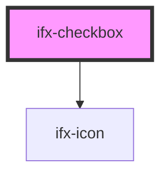

# ifx-checkbox

<!-- Auto Generated Below -->

## Properties

| Property   | Attribute  | Description | Type      | Default |
| ---------- | ---------- | ----------- | --------- | ------- |
| `disabled` | `disabled` |             | `boolean` | `false` |
| `error`    | `error`    |             | `boolean` | `false` |
| `name`     | `name`     |             | `string`  | `''`    |
| `value`    | `value`    |             | `boolean` | `false` |

## Events

| Event       | Description | Type               |
| ----------- | ----------- | ------------------ |
| `ifxChange` |             | `CustomEvent<any>` |

## Dependencies

### Depends on

- [ifx-icon](../icon)

### Graph

----------------------------------------------

*Built with [StencilJS](https://stenciljs.com/)*
