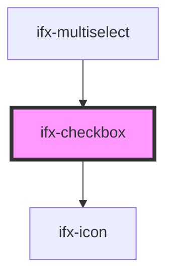

# ifx-checkbox

<!-- Auto Generated Below -->

## Properties

| Property        | Attribute       | Description | Type      | Default |
| --------------- | --------------- | ----------- | --------- | ------- |
| `disabled`      | `disabled`      |             | `boolean` | `false` |
| `error`         | `error`         |             | `boolean` | `false` |
| `indeterminate` | `indeterminate` |             | `boolean` | `false` |
| `name`          | `name`          |             | `string`  | `''`    |
| `size`          | `size`          |             | `string`  | `'m'`   |
| `value`         | `value`         |             | `boolean` | `false` |

## Events

| Event       | Description | Type               |
| ----------- | ----------- | ------------------ |
| `ifxChange` |             | `CustomEvent<any>` |

## Methods

### `toggleCheckedState(newVal: boolean) => Promise<void>`

#### Parameters

| Name     | Type      | Description |
| -------- | --------- | ----------- |
| `newVal` | `boolean` |             |

#### Returns

Type: `Promise<void>`

## Dependencies

### Used by

 - [ifx-multiselect](../select/multi-select)

### Depends on

- [ifx-icon](../icon)

### Graph

----------------------------------------------

*Built with [StencilJS](https://stenciljs.com/)*
