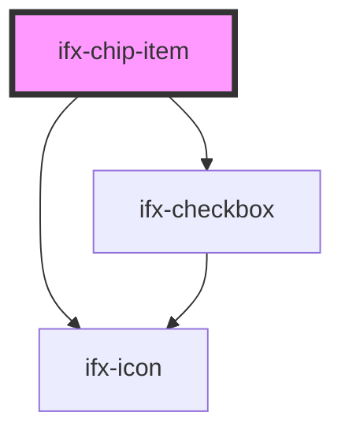

# ifx-chip-item

<!-- Auto Generated Below -->

## Properties

| Property    | Attribute  | Description                                                            | Type        | Default                               |
| ----------- | ---------- | ---------------------------------------------------------------------- | ----------- | ------------------------------------- |
| `chipState` | --         | An internal prop to store the state of the parent (Chip Component).    | `ChipState` | `{ variant: 'multi', size: 'large' }` |
| `selected`  | `selected` | The prop allows to set the initial *selected* status of the Chip Item. | `boolean`   | `false`                               |
| `value`     | `value`    | Value is used to identify the Chip Item.                               | `string`    | `undefined`                           |

## Events

| Event         | Description                                                     | Type                         |
| ------------- | --------------------------------------------------------------- | ---------------------------- |
| `ifxChipItem` | An event emitted whenever the Chip Item is selected/unselected. | `CustomEvent<ChipItemEvent>` |

## Dependencies

### Depends on

- [ifx-checkbox](../../checkbox)
- [ifx-icon](../../icon)

### Graph

----------------------------------------------

*Built with [StencilJS](https://stenciljs.com/)*
