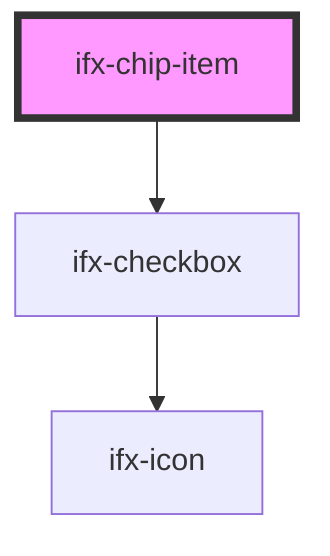

# ifx-chip-item

<!-- Auto Generated Below -->

## Properties

| Property    | Attribute    | Description | Type     | Default               |
| ----------- | ------------ | ----------- | -------- | --------------------- |
| `chipState` | `chip-state` |             | `any`    | `{ variant: 'multi'}` |
| `value`     | `value`      |             | `string` | `undefined`           |

## Dependencies

### Depends on

- [ifx-checkbox](../../checkbox)

### Graph

----------------------------------------------

*Built with [StencilJS](https://stenciljs.com/)*
