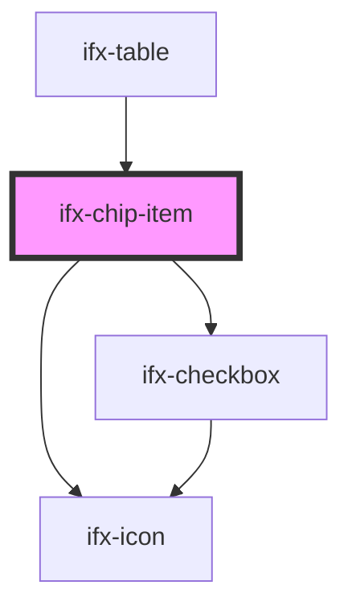

# ifx-chip-item

<!-- Auto Generated Below -->

## Properties

| Property    | Attribute  | Description                              | Type        | Default                                                                    |
| ----------- | ---------- | ---------------------------------------- | ----------- | -------------------------------------------------------------------------- |
| `chipState` | --         | Bahaviour and appearance configuration.  | `ChipState` | `{ 		emitIfxChipItemSelect: true, 		variant: "multi", 		size: "large", 	}` |
| `selected`  | `selected` | Wether the chip is selected (reflected). | `boolean`   | `false`                                                                    |
| `value`     | `value`    | Identifier value for this chip.          | `string`    | `undefined`                                                                |

## Events

| Event               | Description                      | Type                               |
| ------------------- | -------------------------------- | ---------------------------------- |
| `ifxChipItemSelect` | Emitted on chip select/deselect. | `CustomEvent<ChipItemSelectEvent>` |

## Dependencies

### Used by

 - [ifx-table](../../table-advanced-version)

### Depends on

- [ifx-checkbox](../../checkbox)
- [ifx-icon](../../icon)

### Graph

----------------------------------------------

*Built with [StencilJS](https://stenciljs.com/)*
