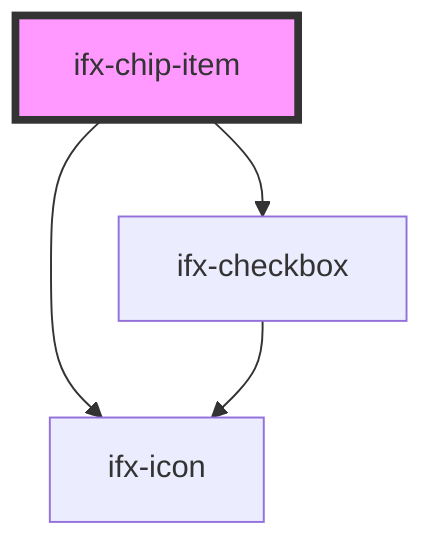

# ifx-chip-item

<!-- Auto Generated Below -->

## Properties

| Property    | Attribute  | Description | Type        | Default                                                            |
| ----------- | ---------- | ----------- | ----------- | ------------------------------------------------------------------ |
| `chipState` | --         |             | `ChipState` | `{ emitIfxChipItemSelect: true, variant: 'multi', size: 'large' }` |
| `selected`  | `selected` |             | `boolean`   | `false`                                                            |
| `value`     | `value`    |             | `string`    | `undefined`                                                        |

## Events

| Event               | Description | Type                               |
| ------------------- | ----------- | ---------------------------------- |
| `ifxChipItemSelect` |             | `CustomEvent<ChipItemSelectEvent>` |

## Dependencies

### Depends on

- [ifx-checkbox](../../checkbox)
- [ifx-icon](../../icon)

### Graph

----------------------------------------------

*Built with [StencilJS](https://stenciljs.com/)*
