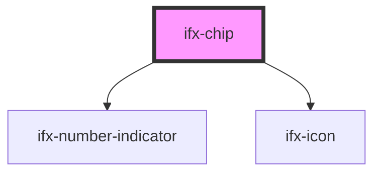

# ifx-chip

<!-- Auto Generated Below -->

## Properties

| Property      | Attribute     | Description                                                                    | Type                  | Default     |
| ------------- | ------------- | ------------------------------------------------------------------------------ | --------------------- | ----------- |
| `placeholder` | `placeholder` | A label/placeholder string.                                                    | `string`              | `''`        |
| `size`        | `size`        | Allows to change the size of Chip and Chip Item component.                     | `"large" \| "small"`  | `'large'`   |
| `value`       | `value`       | Stores the values of each selected options to allow quick access from outside. | `string \| string[]`  | `undefined` |
| `variant`     | `variant`     | Allows to specify variant of the Chip.                                         | `"multi" \| "single"` | `'single'`  |

## Events

| Event       | Description                                                         | Type                           |
| ----------- | ------------------------------------------------------------------- | ------------------------------ |
| `ifxChange` | A global event which emitted when the selected options are changed. | `CustomEvent<ChipItemEvent[]>` |

## Dependencies

### Depends on

- [ifx-number-indicator](../number-indicator)
- [ifx-icon](../icon)

### Graph

----------------------------------------------

*Built with [StencilJS](https://stenciljs.com/)*
