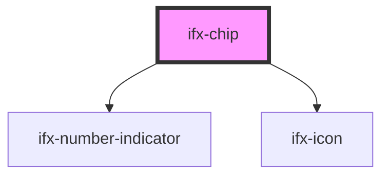

# ifx-chip

<!-- Auto Generated Below -->

## Properties

| Property      | Attribute     | Description | Type                  | Default     |
| ------------- | ------------- | ----------- | --------------------- | ----------- |
| `placeholder` | `placeholder` |             | `string`              | `''`        |
| `size`        | `size`        |             | `"large" \| "small"`  | `'large'`   |
| `value`       | `value`       |             | `string \| string[]`  | `undefined` |
| `variant`     | `variant`     |             | `"multi" \| "single"` | `'single'`  |

## Events

| Event       | Description | Type                                                                                      |
| ----------- | ----------- | ----------------------------------------------------------------------------------------- |
| `ifxChange` |             | `CustomEvent<{ previousSelection: ChipItemEvent[]; currentSelection: ChipItemEvent[]; }>` |

## Dependencies

### Depends on

- [ifx-number-indicator](../number-indicator)
- [ifx-icon](../icon)

### Graph

----------------------------------------------

*Built with [StencilJS](https://stenciljs.com/)*
