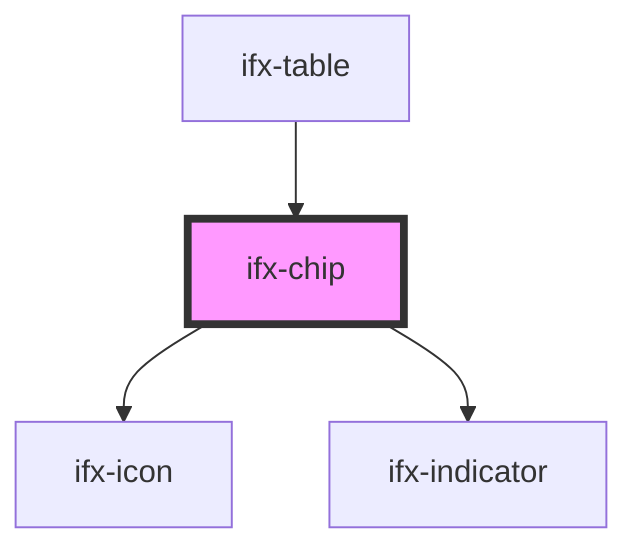

# ifx-chip

<!-- Auto Generated Below -->

## Properties

| Property      | Attribute     | Description | Type                                            | Default      |
| ------------- | ------------- | ----------- | ----------------------------------------------- | ------------ |
| `ariaLabel`   | `aria-label`  |             | `string`                                        | `undefined`  |
| `disabled`    | `disabled`    |             | `boolean`                                       | `false`      |
| `icon`        | `icon`        |             | `string`                                        | `""`         |
| `placeholder` | `placeholder` |             | `string`                                        | `""`         |
| `readOnly`    | `read-only`   |             | `boolean`                                       | `false`      |
| `size`        | `size`        |             | `"large" \| "medium" \| "small"`                | `"medium"`   |
| `theme`       | `theme`       |             | `"filled-dark" \| "filled-light" \| "outlined"` | `"outlined"` |
| `value`       | `value`       |             | `string \| string[]`                            | `undefined`  |
| `variant`     | `variant`     |             | `"multi" \| "single"`                           | `"single"`   |

## Events

| Event       | Description | Type                                                                                                                |
| ----------- | ----------- | ------------------------------------------------------------------------------------------------------------------- |
| `ifxChange` |             | `CustomEvent<{ previousSelection: ChipItemSelectEvent[]; currentSelection: ChipItemSelectEvent[]; name: string; }>` |

## Dependencies

### Used by

 - [ifx-table](../table-advanced-version)

### Depends on

- [ifx-icon](../icon)
- [ifx-indicator](../indicator)

### Graph

----------------------------------------------

*Built with [StencilJS](https://stenciljs.com/)*
