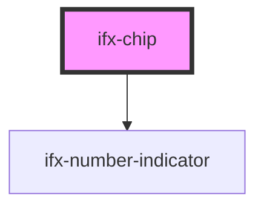

# ifx-chip

<!-- Auto Generated Below -->

## Properties

| Property      | Attribute     | Description | Type                  | Default    |
| ------------- | ------------- | ----------- | --------------------- | ---------- |
| `placeholder` | `placeholder` |             | `string`              | `''`       |
| `size`        | `size`        |             | `"large" \| "small"`  | `'large'`  |
| `variant`     | `variant`     |             | `"multi" \| "single"` | `'single'` |

## Dependencies

### Depends on

- [ifx-number-indicator](../number-indicator)

### Graph

----------------------------------------------

*Built with [StencilJS](https://stenciljs.com/)*
