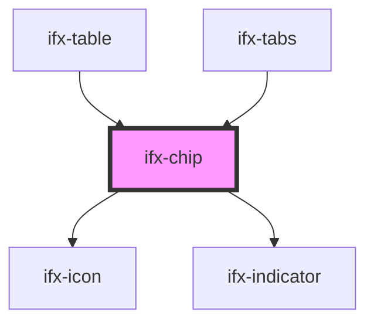

# ifx-chip

<!-- Auto Generated Below -->

## Properties

| Property        | Attribute         | Description                 | Type                                            | Default      |
| --------------- | ----------------- | --------------------------- | ----------------------------------------------- | ------------ |
| `ariaLabelText` | `aria-label-text` | ARIA Label text             | `string`                                        | `undefined`  |
| `disabled`      | `disabled`        | Disabeled state             | `boolean`                                       | `false`      |
| `icon`          | `icon`            | Sets Icon                   | `string`                                        | `""`         |
| `placeholder`   | `placeholder`     | Placeholder text            | `string`                                        | `""`         |
| `readOnly`      | `read-only`       | Read-only state             | `boolean`                                       | `false`      |
| `size`          | `size`            | Component size              | `"large" \| "medium" \| "small"`                | `"medium"`   |
| `theme`         | `theme`           | Visual theme                | `"filled-dark" \| "filled-light" \| "outlined"` | `"outlined"` |
| `value`         | `value`           | Current selection (mutable) | `string \| string[]`                            | `undefined`  |
| `variant`       | `variant`         | Selection mode              | `"multi" \| "single"`                           | `"single"`   |

## Events

| Event       | Description                | Type                                                                                                                |
| ----------- | -------------------------- | ------------------------------------------------------------------------------------------------------------------- |
| `ifxChange` | Fires on selection change. | `CustomEvent<{ previousSelection: ChipItemSelectEvent[]; currentSelection: ChipItemSelectEvent[]; name: string; }>` |

## Dependencies

### Used by

 - [ifx-table](../table-advanced-version)
 - [ifx-tabs](../tabs)

### Depends on

- [ifx-icon](../icon)
- [ifx-indicator](../indicator)

### Graph

----------------------------------------------

*Built with [StencilJS](https://stenciljs.com/)*
