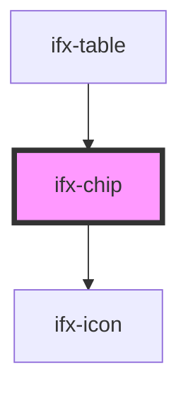

# ifx-chip

<!-- Auto Generated Below -->

## Properties

| Property      | Attribute     | Description | Type     | Default     |
| ------------- | ------------- | ----------- | -------- | ----------- |
| `placeholder` | `placeholder` |             | `string` | `undefined` |

## Events

| Event             | Description | Type                            |
| ----------------- | ----------- | ------------------------------- |
| `ifxDropdownMenu` |             | `CustomEvent<CustomEvent<any>>` |

## Dependencies

### Used by

 - [ifx-table](../table-advanced-version)

### Depends on

- [ifx-icon](../icon)

### Graph

----------------------------------------------

*Built with [StencilJS](https://stenciljs.com/)*
