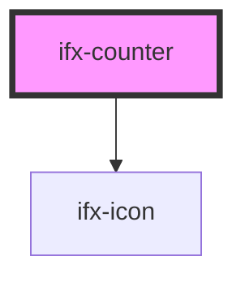

# ifx-counter

<!-- Auto Generated Below -->

## Properties

| Property | Attribute | Description                                                      | Type     | Default |
| -------- | --------- | ---------------------------------------------------------------- | -------- | ------- |
| `value`  | `value`   | The current value of the counter. Must be a non-negative number. | `number` | `0`     |

## Events

| Event       | Description                                                                | Type                  |
| ----------- | -------------------------------------------------------------------------- | --------------------- |
| `ifxChange` | Emitted when the counter value changes. Returns the new value as a number. | `CustomEvent<number>` |

## Dependencies

### Depends on

- [ifx-icon](../icon)

### Graph

----------------------------------------------

*Built with [StencilJS](https://stenciljs.com/)*
