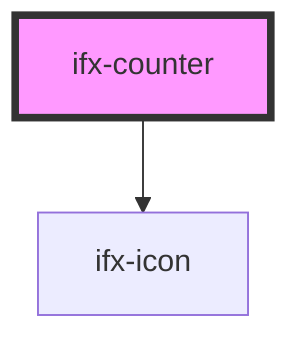

# ifx-counter

<!-- Auto Generated Below -->

## Properties

| Property | Attribute | Description | Type     | Default |
| -------- | --------- | ----------- | -------- | ------- |
| `value`  | `value`   |             | `number` | `0`     |

## Events

| Event       | Description | Type                  |
| ----------- | ----------- | --------------------- |
| `ifxChange` |             | `CustomEvent<number>` |

## Dependencies

### Depends on

- [ifx-icon](../icon)

### Graph

----------------------------------------------

*Built with [StencilJS](https://stenciljs.com/)*
