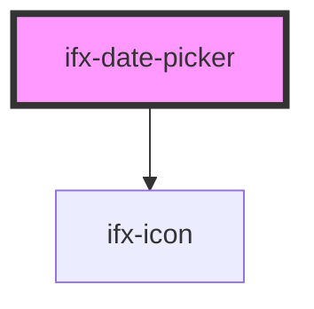

# ifx-date-picker

<!-- Auto Generated Below -->

## Properties

| Property   | Attribute  | Description | Type      | Default |
| ---------- | ---------- | ----------- | --------- | ------- |
| `disabled` | `disabled` |             | `boolean` | `false` |
| `error`    | `error`    |             | `boolean` | `false` |
| `size`     | `size`     |             | `string`  | `'s'`   |
| `success`  | `success`  |             | `boolean` | `false` |

## Events

| Event     | Description | Type               |
| --------- | ----------- | ------------------ |
| `ifxDate` |             | `CustomEvent<any>` |

## Dependencies

### Depends on

- [ifx-icon](../icon)

### Graph

----------------------------------------------

*Built with [StencilJS](https://stenciljs.com/)*
