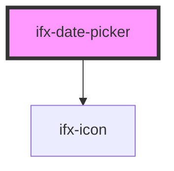

# ifx-date-picker

<!-- Auto Generated Below -->

## Properties

| Property        | Attribute         | Description                                     | Type      | Default     |
| --------------- | ----------------- | ----------------------------------------------- | --------- | ----------- |
| `ariaLabelText` | `aria-label-text` | Aria label for the date picker input            | `string`  | `undefined` |
| `autocomplete`  | `autocomplete`    | Autocomplete attribute for the input            | `string`  | `"on"`      |
| `caption`       | `caption`         | Caption text displayed below the date picker    | `string`  | `undefined` |
| `disabled`      | `disabled`        | Whether the date picker is disabled             | `boolean` | `false`     |
| `error`         | `error`           | Error state of the date picker                  | `boolean` | `false`     |
| `label`         | `label`           | Label text for the date picker                  | `string`  | `undefined` |
| `max`           | `max`             | Maximum allowed date                            | `string`  | `undefined` |
| `min`           | `min`             | Minimum allowed date                            | `string`  | `undefined` |
| `required`      | `required`        | Whether the date picker is required             | `boolean` | `false`     |
| `size`          | `size`            | Size of the date picker input                   | `string`  | `"s"`       |
| `success`       | `success`         | Success state of the date picker                | `boolean` | `false`     |
| `type`          | `type`            | Type of date input (date, datetime-local, etc.) | `string`  | `"date"`    |
| `value`         | `value`           | The value of the date picker                    | `string`  | `undefined` |

## Events

| Event     | Description                           | Type               |
| --------- | ------------------------------------- | ------------------ |
| `ifxDate` | Event emitted when date value changes | `CustomEvent<any>` |

## Methods

### `clear() => Promise<void>`

Clears the date picker value

#### Returns

Type: `Promise<void>`

## Dependencies

### Depends on

- [ifx-icon](../icon)

### Graph

----------------------------------------------

*Built with [StencilJS](https://stenciljs.com/)*
