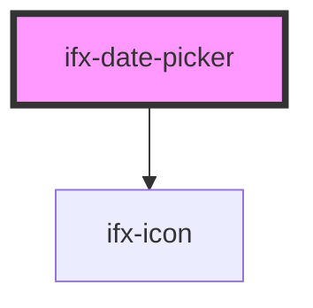

# ifx-date-picker

<!-- Auto Generated Below -->

## Properties

| Property       | Attribute      | Description | Type      | Default     |
| -------------- | -------------- | ----------- | --------- | ----------- |
| `ariaLabel`    | `aria-label`   |             | `string`  | `undefined` |
| `autocomplete` | `autocomplete` |             | `string`  | `"on"`      |
| `caption`      | `caption`      |             | `string`  | `undefined` |
| `disabled`     | `disabled`     |             | `boolean` | `false`     |
| `error`        | `error`        |             | `boolean` | `false`     |
| `label`        | `label`        |             | `string`  | `undefined` |
| `max`          | `max`          |             | `string`  | `undefined` |
| `min`          | `min`          |             | `string`  | `undefined` |
| `required`     | `required`     |             | `boolean` | `false`     |
| `size`         | `size`         |             | `string`  | `"s"`       |
| `success`      | `success`      |             | `boolean` | `false`     |
| `type`         | `type`         |             | `string`  | `"date"`    |
| `value`        | `value`        |             | `string`  | `undefined` |

## Events

| Event     | Description | Type               |
| --------- | ----------- | ------------------ |
| `ifxDate` |             | `CustomEvent<any>` |

## Dependencies

### Depends on

- [ifx-icon](../icon)

### Graph

----------------------------------------------

*Built with [StencilJS](https://stenciljs.com/)*
