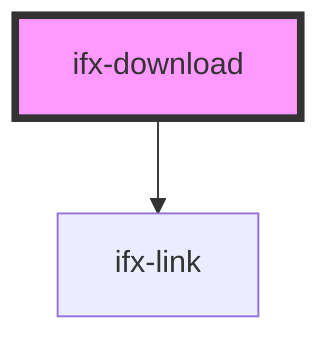

# ifx-download

<!-- Auto Generated Below -->

## Properties

| Property | Attribute | Description                                    | Type              | Default |
| -------- | --------- | ---------------------------------------------- | ----------------- | ------- |
| `tokens` | `tokens`  | Type of style tokens to display (CSS or SCSS). | `"css" \| "scss"` | `"css"` |

## Dependencies

### Depends on

- [ifx-link](../link)

### Graph

----------------------------------------------

*Built with [StencilJS](https://stenciljs.com/)*
