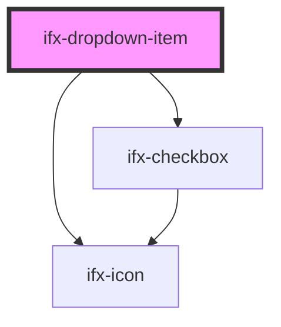

# ifx-dropdown-item

<!-- Auto Generated Below -->

## Properties

| Property    | Attribute   | Description | Type         | Default     |
| ----------- | ----------- | ----------- | ------------ | ----------- |
| `checkable` | `checkable` |             | `boolean`    | `false`     |
| `disabled`  | `disabled`  |             | `boolean`    | `undefined` |
| `icon`      | `icon`      |             | `string`     | `undefined` |
| `label`     | `label`     |             | `string`     | `undefined` |
| `size`      | `size`      |             | `"m" \| "s"` | `undefined` |
| `target`    | `target`    |             | `string`     | `"_self"`   |
| `url`       | `url`       |             | `string`     | `""`        |
| `value`     | `value`     |             | `string`     | `""`        |

## Events

| Event        | Description | Type                  |
| ------------ | ----------- | --------------------- |
| `itemValues` |             | `CustomEvent<Object>` |

## Dependencies

### Depends on

- [ifx-checkbox](../checkbox)
- [ifx-icon](../icon)

### Graph

----------------------------------------------

*Built with [StencilJS](https://stenciljs.com/)*
