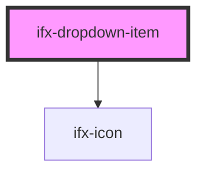

# ifx-dropdown-item

<!-- Auto Generated Below -->

## Properties

| Property | Attribute | Description | Type      | Default     |
| -------- | --------- | ----------- | --------- | ----------- |
| `error`  | `error`   |             | `boolean` | `false`     |
| `hide`   | `hide`    |             | `boolean` | `false`     |
| `href`   | `href`    |             | `string`  | `""`        |
| `icon`   | `icon`    |             | `string`  | `undefined` |
| `target` | `target`  |             | `string`  | `"_self"`   |

## Events

| Event             | Description | Type               |
| ----------------- | ----------- | ------------------ |
| `ifxDropdownItem` |             | `CustomEvent<any>` |

## Dependencies

### Depends on

- [ifx-icon](../../icon)

### Graph

----------------------------------------------

*Built with [StencilJS](https://stenciljs.com/)*
