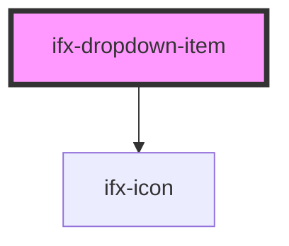

# ifx-dropdown-item

<!-- Auto Generated Below -->

## Properties

| Property | Attribute | Description                                             | Type      | Default     |
| -------- | --------- | ------------------------------------------------------- | --------- | ----------- |
| `error`  | `error`   | If true, this item is shown in an error style.          | `boolean` | `false`     |
| `hide`   | `hide`    | If true, this dropdown item is hidden.                  | `boolean` | `false`     |
| `href`   | `href`    | Link the dropdown item should navigate to when clicked. | `string`  | `""`        |
| `icon`   | `icon`    | Icon to show in the dropdown item.                      | `string`  | `undefined` |
| `target` | `target`  | Where to open the link.                                 | `string`  | `"_self"`   |

## Events

| Event             | Description                                          | Type               |
| ----------------- | ---------------------------------------------------- | ------------------ |
| `ifxDropdownItem` | Fired when the dropdown item is clicked or selected. | `CustomEvent<any>` |

## Dependencies

### Depends on

- [ifx-icon](../../icon)

### Graph

```mermaid
graph TD;
  ifx-dropdown-item --> ifx-icon
  style ifx-dropdown-item fill:#f9f,stroke:#333,stroke-width:4px
```

----------------------------------------------

*Built with [StencilJS](https://stenciljs.com/)*
