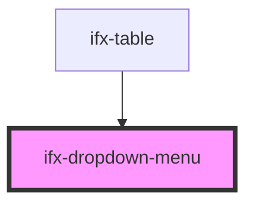

# ifx-dropdown-menu

<!-- Auto Generated Below -->

## Properties

| Property | Attribute | Description | Type      | Default |
| -------- | --------- | ----------- | --------- | ------- |
| `isOpen` | `is-open` |             | `boolean` | `false` |
| `size`   | `size`    |             | `string`  | `'l'`   |

## Events

| Event                 | Description | Type                            |
| --------------------- | ----------- | ------------------------------- |
| `ifxDropdownMenuItem` |             | `CustomEvent<CustomEvent<any>>` |
| `menuSize`            |             | `CustomEvent<any>`              |

## Dependencies

### Used by

 - [ifx-table](../../table-advanced-version)

### Graph

----------------------------------------------

*Built with [StencilJS](https://stenciljs.com/)*
