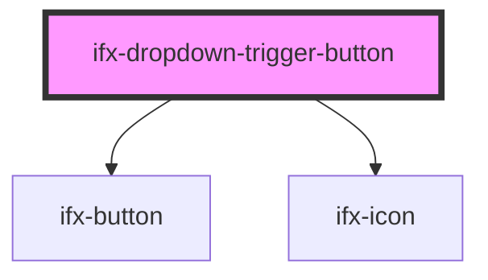

# ifx-dropdown-item

<!-- Auto Generated Below -->

## Properties

| Property    | Attribute    | Description | Type                                                             | Default     |
| ----------- | ------------ | ----------- | ---------------------------------------------------------------- | ----------- |
| `color`     | `color`      |             | `"danger" \| "primary" \| "secondary" \| "success" \| "warning"` | `'primary'` |
| `disabled`  | `disabled`   |             | `boolean`                                                        | `undefined` |
| `hideArrow` | `hide-arrow` |             | `boolean`                                                        | `false`     |
| `icon`      | `icon`       |             | `string`                                                         | `undefined` |
| `isOpen`    | `is-open`    |             | `boolean`                                                        | `false`     |
| `size`      | `size`       |             | `"m" \| "s"`                                                     | `'m'`       |
| `variant`   | `variant`    |             | `"outline" \| "outline-text" \| "solid"`                         | `'solid'`   |

## Dependencies

### Depends on

- [ifx-button](../../button)
- [ifx-icon](../../icon)

### Graph

----------------------------------------------

*Built with [StencilJS](https://stenciljs.com/)*
