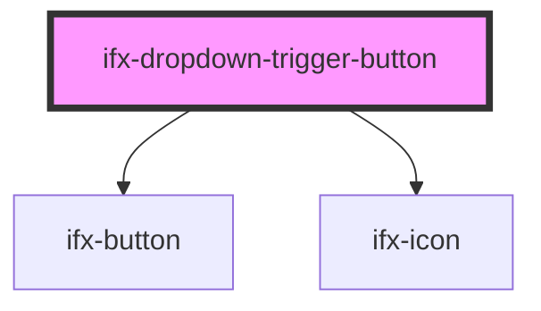

# ifx-dropdown-item

<!-- Auto Generated Below -->

## Properties

| Property    | Attribute    | Description | Type                                 | Default     |
| ----------- | ------------ | ----------- | ------------------------------------ | ----------- |
| `disabled`  | `disabled`   |             | `boolean`                            | `undefined` |
| `hideArrow` | `hide-arrow` |             | `boolean`                            | `false`     |
| `isOpen`    | `is-open`    |             | `boolean`                            | `false`     |
| `size`      | `size`       |             | `"m" \| "s"`                         | `"m"`       |
| `theme`     | `theme`      |             | `"danger" \| "default" \| "inverse"` | `"default"` |
| `variant`   | `variant`    |             | `"primary"`                          | `undefined` |

## Dependencies

### Depends on

- [ifx-button](../../button)
- [ifx-icon](../../icon)

### Graph

----------------------------------------------

*Built with [StencilJS](https://stenciljs.com/)*
