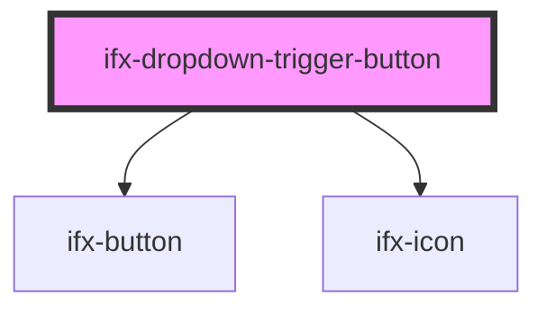

# ifx-dropdown-item

<!-- Auto Generated Below -->

## Properties

| Property    | Attribute    | Description                                     | Type                                 | Default     |
| ----------- | ------------ | ----------------------------------------------- | ------------------------------------ | ----------- |
| `disabled`  | `disabled`   | If true, trigger is disabled and not clickable. | `boolean`                            | `undefined` |
| `hideArrow` | `hide-arrow` | If true, hides the dropdown arrow icon.         | `boolean`                            | `false`     |
| `isOpen`    | `is-open`    | Controls wether the dropdown trigger is open    | `boolean`                            | `false`     |
| `size`      | `size`       | Size of the trigger button.                     | `"m" \| "s"`                         | `"m"`       |
| `theme`     | `theme`      | Color theme of the trigger.                     | `"danger" \| "default" \| "inverse"` | `"default"` |
| `variant`   | `variant`    | Visual style variant.                           | `"primary"`                          | `undefined` |

## Dependencies

### Depends on

- [ifx-button](../../button)
- [ifx-icon](../../icon)

### Graph

```mermaid
graph TD;
  ifx-dropdown-trigger-button --> ifx-button
  ifx-dropdown-trigger-button --> ifx-icon
  style ifx-dropdown-trigger-button fill:#f9f,stroke:#333,stroke-width:4px
```

----------------------------------------------

*Built with [StencilJS](https://stenciljs.com/)*
