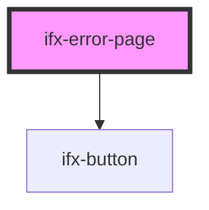

# ifx-error-page

<!-- Auto Generated Below -->

## Properties

| Property          | Attribute          | Description | Type                                       | Default     |
| ----------------- | ------------------ | ----------- | ------------------------------------------ | ----------- |
| `alt`             | `alt`              |             | `string`                                   | `undefined` |
| `description`     | `description`      |             | `string`                                   | `undefined` |
| `headline`        | `headline`         |             | `string`                                   | `undefined` |
| `illustrationUrl` | `illustration-url` |             | `string`                                   | `undefined` |
| `type`            | `type`             |             | `"403" \| "404" \| "503" \| "maintenance"` | `"403"`     |

## Dependencies

### Depends on

- [ifx-button](../button)

### Graph

----------------------------------------------

*Built with [StencilJS](https://stenciljs.com/)*
