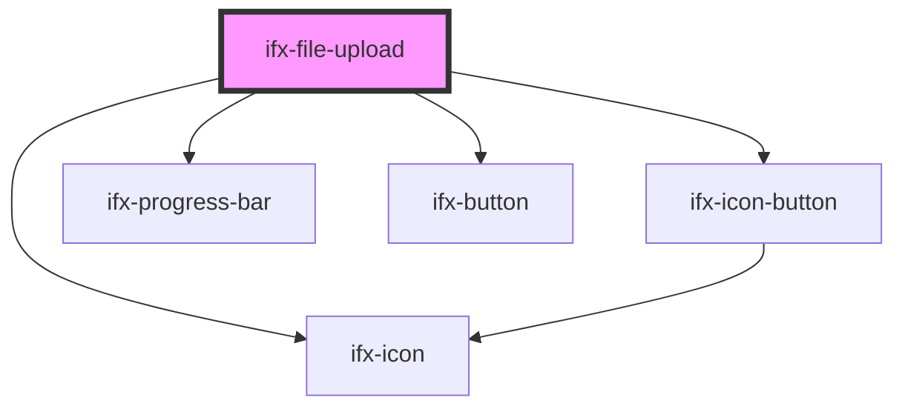

# ifx-file-upload

<!-- Auto Generated Below -->

## Properties

| Property                        | Attribute                          | Description                                                                                                                                                                  | Type                                                                     | Default                                                           |
| ------------------------------- | ---------------------------------- | ---------------------------------------------------------------------------------------------------------------------------------------------------------------------------- | ------------------------------------------------------------------------ | ----------------------------------------------------------------- |
| `additionalAllowedFileTypes`    | `additional-allowed-file-types`    |                                                                                                                                                                              | `string \| string[]`                                                     | `[]`                                                              |
| `allowAnyFileType`              | `allow-any-file-type`              | When set to true, allows any file type to be uploaded (no file type restrictions).                                                                                           | `boolean`                                                                | `false`                                                           |
| `allowedFileExtensions`         | `allowed-file-extensions`          | Custom file extensions to allow (e.g., 'xml', 'asc', 'cfg'). Recommended format: without dots. Also accepts format with dots like '.xml'. Do not use wildcards like '*.xml'. | `string \| string[]`                                                     | `[]`                                                              |
| `allowedFileTypes`              | `allowed-file-types`               | Default set of allowed file extensions (used internally). Can be extended using `additionalAllowedFileTypes`.                                                                | `string \| string[]`                                                     | `undefined`                                                       |
| `ariaLabelBrowseFiles`          | `aria-label-browse-files`          |                                                                                                                                                                              | `string`                                                                 | `"Browse files"`                                                  |
| `ariaLabelCancelUpload`         | `aria-label-cancel-upload`         |                                                                                                                                                                              | `string`                                                                 | `"Cancel upload"`                                                 |
| `ariaLabelDropzone`             | `aria-label-dropzone`              |                                                                                                                                                                              | `string`                                                                 | `"Upload area. Click to browse or drag and drop files."`          |
| `ariaLabelFileInput`            | `aria-label-file-input`            |                                                                                                                                                                              | `string`                                                                 | `"Upload file"`                                                   |
| `ariaLabelRemoveFile`           | `aria-label-remove-file`           |                                                                                                                                                                              | `string`                                                                 | `"Remove file"`                                                   |
| `ariaLabelRetryUpload`          | `aria-label-retry-upload`          |                                                                                                                                                                              | `string`                                                                 | `"Retry upload"`                                                  |
| `ariaLabelUploadFailedStatus`   | `aria-label-upload-failed-status`  |                                                                                                                                                                              | `string`                                                                 | `"Upload failed"`                                                 |
| `ariaLabelUploadedStatus`       | `aria-label-uploaded-status`       |                                                                                                                                                                              | `string`                                                                 | `"Upload completed"`                                              |
| `ariaLabelUploadingStatus`      | `aria-label-uploading-status`      |                                                                                                                                                                              | `string`                                                                 | `"Upload in progress"`                                            |
| `disabled`                      | `disabled`                         |                                                                                                                                                                              | `boolean`                                                                | `false`                                                           |
| `dragAndDrop`                   | `drag-and-drop`                    |                                                                                                                                                                              | `boolean`                                                                | `false`                                                           |
| `label`                         | `label`                            |                                                                                                                                                                              | `string`                                                                 | `"Label"`                                                         |
| `labelBrowseFiles`              | `label-browse-files`               |                                                                                                                                                                              | `string`                                                                 | `"Browse files"`                                                  |
| `labelDragAndDrop`              | `label-drag-and-drop`              |                                                                                                                                                                              | `string`                                                                 | `"Drag & Drop or browse files to upload"`                         |
| `labelFilePlural`               | `label-file-plural`                |                                                                                                                                                                              | `string`                                                                 | `"files"`                                                         |
| `labelFileSingular`             | `label-file-singular`              |                                                                                                                                                                              | `string`                                                                 | `"file"`                                                          |
| `labelFileTooLarge`             | `label-file-too-large`             |                                                                                                                                                                              | `string`                                                                 | `"Upload failed. Max file size: {{size}}MB."`                     |
| `labelMaxFilesExceeded`         | `label-max-files-exceeded`         |                                                                                                                                                                              | `string`                                                                 | `"Upload limit exceeded. Only {{count}} {{files}} allowed."`      |
| `labelMaxFilesInfo`             | `label-max-files-info`             |                                                                                                                                                                              | `string`                                                                 | `"Up to {{count}} {{files}}."`                                    |
| `labelRequiredError`            | `label-required-error`             |                                                                                                                                                                              | `string`                                                                 | `"At least one file must be uploaded"`                            |
| `labelSupportedFormatsTemplate` | `label-supported-formats-template` |                                                                                                                                                                              | `string`                                                                 | `"Supported file formats: {{types}}. Max file size: {{size}}MB."` |
| `labelUnsupportedFileType`      | `label-unsupported-file-type`      |                                                                                                                                                                              | `string`                                                                 | `"Unsupported file type."`                                        |
| `labelUploadFailed`             | `label-upload-failed`              |                                                                                                                                                                              | `string`                                                                 | `"Upload failed. Please try again."`                              |
| `labelUploaded`                 | `label-uploaded`                   |                                                                                                                                                                              | `string`                                                                 | `"Successfully uploaded"`                                         |
| `labelUploadedFilesHeading`     | `label-uploaded-files-heading`     |                                                                                                                                                                              | `string`                                                                 | `"Uploaded files"`                                                |
| `maxFileSizeMB`                 | `max-file-size-m-b`                |                                                                                                                                                                              | `number`                                                                 | `7`                                                               |
| `maxFiles`                      | `max-files`                        |                                                                                                                                                                              | `number`                                                                 | `undefined`                                                       |
| `required`                      | `required`                         |                                                                                                                                                                              | `boolean`                                                                | `false`                                                           |
| `uploadHandler`                 | --                                 |                                                                                                                                                                              | `(file: File, onProgress?: (progress: number) => void) => Promise<void>` | `undefined`                                                       |

## Events

| Event                           | Description | Type                                                                                   |
| ------------------------------- | ----------- | -------------------------------------------------------------------------------------- |
| `ifxFileUploadAbort`            |             | `CustomEvent<{ file: File; }>`                                                         |
| `ifxFileUploadAdd`              |             | `CustomEvent<{ addedFiles: File[]; files: File[]; }>`                                  |
| `ifxFileUploadAllComplete`      |             | `CustomEvent<{ files: File[]; }>`                                                      |
| `ifxFileUploadChange`           |             | `CustomEvent<{ files: File[]; }>`                                                      |
| `ifxFileUploadClick`            |             | `CustomEvent<void>`                                                                    |
| `ifxFileUploadComplete`         |             | `CustomEvent<{ file: File; }>`                                                         |
| `ifxFileUploadDrop`             |             | `CustomEvent<{ droppedFiles: File[]; acceptedFiles: File[]; rejectedFiles: File[]; }>` |
| `ifxFileUploadError`            |             | `CustomEvent<{ errorType: string; file: File; message: string; reason?: string; }>`    |
| `ifxFileUploadInvalid`          |             | `CustomEvent<{ file: File; reason: string; }>`                                         |
| `ifxFileUploadMaxFilesExceeded` |             | `CustomEvent<{ maxFiles: number; attempted: number; }>`                                |
| `ifxFileUploadRemove`           |             | `CustomEvent<{ removedFile: File; files: File[]; }>`                                   |
| `ifxFileUploadRetry`            |             | `CustomEvent<{ file: File; }>`                                                         |
| `ifxFileUploadStart`            |             | `CustomEvent<{ file: File; }>`                                                         |
| `ifxFileUploadValidation`       |             | `CustomEvent<{ valid: boolean; }>`                                                     |

## Methods

### `injectDemoState() => Promise<void>`

#### Returns

Type: `Promise<void>`

### `triggerDemoValidation() => Promise<void>`

#### Returns

Type: `Promise<void>`

## Dependencies

### Depends on

- [ifx-icon](../icon)
- [ifx-icon-button](../icon-button)
- [ifx-progress-bar](../progress-bar)
- [ifx-button](../button)

### Graph

----------------------------------------------

*Built with [StencilJS](https://stenciljs.com/)*
