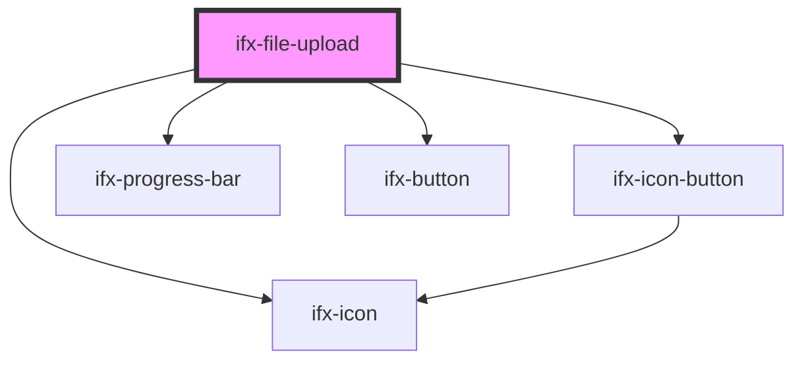

# ifx-file-upload

<!-- Auto Generated Below -->

## Properties

| Property                        | Attribute                          | Description | Type                            | Default                                                           |
| ------------------------------- | ---------------------------------- | ----------- | ------------------------------- | ----------------------------------------------------------------- |
| `allowedFileTypes`              | `allowed-file-types`               |             | `string \| string[]`            | `['jpg', 'jpeg', 'png', 'pdf', 'mov', 'mp3', 'mp4']`              |
| `dragAndDrop`                   | `drag-and-drop`                    |             | `boolean`                       | `false`                                                           |
| `labelBrowseFiles`              | `label-browse-files`               |             | `string`                        | `'Browse files'`                                                  |
| `labelDragAndDrop`              | `label-drag-and-drop`              |             | `string`                        | `'Drag & Drop or browse files to upload'`                         |
| `labelFileTooLarge`             | `label-file-too-large`             |             | `string`                        | `'Upload failed. Max file size: {{size}}MB.'`                     |
| `labelSupportedFormatsTemplate` | `label-supported-formats-template` |             | `string`                        | `'Supported file formats: {{types}}. Max file size: {{size}}MB.'` |
| `labelUnsupportedFileType`      | `label-unsupported-file-type`      |             | `string`                        | `'Unsupported file typ.'`                                         |
| `labelUploaded`                 | `label-uploaded`                   |             | `string`                        | `'Successfully uploaded'`                                         |
| `maxFileSizeMB`                 | `max-file-size-m-b`                |             | `number`                        | `7`                                                               |
| `uploadHandler`                 | --                                 |             | `(file: File) => Promise<void>` | `undefined`                                                       |

## Events

| Event                   | Description | Type                                                                                   |
| ----------------------- | ----------- | -------------------------------------------------------------------------------------- |
| `ifxFileUploadAbort`    |             | `CustomEvent<{ file: File; }>`                                                         |
| `ifxFileUploadAdd`      |             | `CustomEvent<{ addedFiles: File[]; files: File[]; }>`                                  |
| `ifxFileUploadChange`   |             | `CustomEvent<{ files: File[]; }>`                                                      |
| `ifxFileUploadClick`    |             | `CustomEvent<void>`                                                                    |
| `ifxFileUploadComplete` |             | `CustomEvent<{ file: File; }>`                                                         |
| `ifxFileUploadDrop`     |             | `CustomEvent<{ droppedFiles: File[]; acceptedFiles: File[]; rejectedFiles: File[]; }>` |
| `ifxFileUploadError`    |             | `CustomEvent<{ errorType: string; file: File; message: string; }>`                     |
| `ifxFileUploadInvalid`  |             | `CustomEvent<{ file: File; reason: string; }>`                                         |
| `ifxFileUploadRemove`   |             | `CustomEvent<{ removedFile: File; files: File[]; }>`                                   |
| `ifxFileUploadStart`    |             | `CustomEvent<{ file: File; }>`                                                         |

## Methods

### `injectDemoState() => Promise<void>`

#### Returns

Type: `Promise<void>`

## Dependencies

### Depends on

- [ifx-icon](../icon)
- [ifx-icon-button](../icon-button)
- [ifx-progress-bar](../progress-bar)
- [ifx-button](../button)

### Graph

----------------------------------------------

*Built with [StencilJS](https://stenciljs.com/)*
